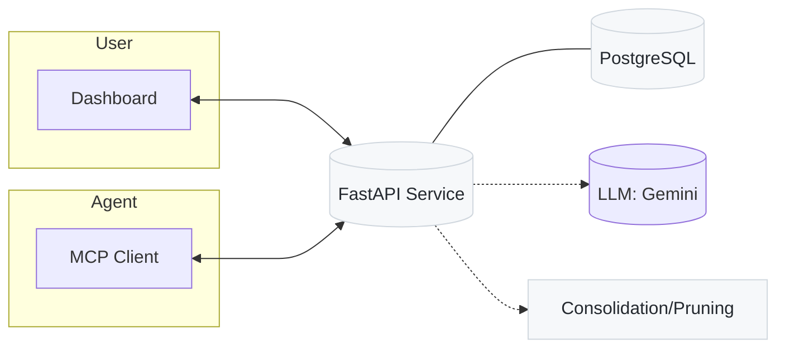

# Hindsight AI

Give your AI agents a memory — and make it better every day.

Hindsight AI is a small, focused stack that lets you:
- Store rich “memory blocks” about interactions, errors, decisions and outcomes.
- Retrieve, browse and curate those memories with a clean dashboard and API.
- Continuously improve memory quality via LLM‑powered consolidation and pruning.

It’s built for agent developers who want persistent learning and human‑in‑the‑loop control without adopting a heavy platform.


## What’s Inside

- Backend API: `apps/hindsight-service` (FastAPI + SQLAlchemy + PostgreSQL)
- Dashboard: `apps/hindsight-dashboard` (React)
- MCP Server: `mcp-servers/hindsight-mcp` (Model Context Protocol tools for agents)
- Copilot Assistant: Next.js “generative UI” app — coming soon
- Infra: `infra/` (Docker Compose, DB, migrations, backups, Traefik + OAuth2 proxy for prod)

## Quickstart (5 minutes)

Prereqs: Docker + Docker Compose installed.

1) Copy env
```bash
cp .env.example .env
```
2) Restore the sample database (recommended while migrations are being fixed)
```bash
./infra/scripts/restore_db.sh
```

3) Start the stack
```bash
./start_hindsight.sh
```

4) Open the apps
- Dashboard: http://localhost:3000
- API docs: http://localhost:8000/docs

3) Create your first agent and memory block
```bash
# Create an agent
curl -s -X POST http://localhost:8000/agents/ \
  -H 'Content-Type: application/json' \
  -d '{"agent_name":"dev-agent"}'

# Note the returned agent_id, then create a memory block
AGENT_ID=<paste-id>
curl -s -X POST http://localhost:8000/memory-blocks/ \
  -H 'Content-Type: application/json' \
  -d '{
    "agent_id":"'"$AGENT_ID"'",
    "conversation_id":"00000000-0000-0000-0000-000000000001",
    "content":"Investigated intermittent 500 errors on POST /checkout.",
    "lessons_learned":"Retry policy too aggressive; added backoff and fixed a race condition.",
    "errors":"Timeouts from payment gateway",
    "metadata": {"service":"checkout","latency_ms":720}
  }'
```

That’s it. Browse memories, filter, give feedback, and try consolidation/pruning from the dashboard.

## Why Hindsight?

- Memory with structure: text + lessons learned + keywords + JSON metadata
- Retrieval that compounds: feedback scores and retrieval count support curation
- Human‑in‑the‑loop improvement: LLM‑powered consolidation suggestions to merge duplicates and raise signal
- Operational hygiene: pruning suggestions for low‑value or stale blocks
- Plug into agents: MCP server tools to create/retrieve/report feedback directly from your agent runtime

## Architecture



Key pieces:
- `hindsight-service`: REST API for agents and the dashboard. Includes consolidation (duplicate grouping + LLM rewrite) and pruning suggestions.
- `hindsight-dashboard`: Zero‑setup UI to browse, filter, archive, and validate/reject suggestions.
- `hindsight-mcp`: MCP server exposing tools like create_memory_block, retrieve_relevant_memories, report_memory_feedback.
- `infra`: Local dev via Docker Compose; production via Traefik + OAuth2‑Proxy (Google) + Cloudflare DNS challenge.

## Data Model Highlights

Each memory block includes:
- `content`, `errors`, `lessons_learned`
- `metadata` (JSONB) for anything structured (metrics, flags, traces)
- `keywords`, `feedback_score`, `retrieval_count`
- `archived`, `archived_at`

Consolidation suggestions store LLM‑generated merged content/lessons/keywords and the original memory IDs for review.

## Use It From Your Agent (MCP)

Point Claude Desktop (or any MCP client) at `mcp-servers/hindsight-mcp`:

```json
{
  "mcpServers": {
    "hindsight-mcp": {
      "command": "node",
      "args": ["/path/to/hindsight-ai/mcp-servers/hindsight-mcp/build/index.js"],
      "env": {
        "MEMORY_SERVICE_BASE_URL": "http://localhost:8000",
        "DEFAULT_AGENT_ID": "<agent-uuid>",
        "DEFAULT_CONVERSATION_ID": "00000000-0000-0000-0000-000000000001"
      },
      "transportType": "stdio"
    }
  }
}
```

Tools available include:
- `create_memory_block` — save new content/lessons/errors/metadata
- `retrieve_relevant_memories` — keyword search scoped by agent/conversation
- `report_memory_feedback` — upvote/downvote/neutral to influence future curation
- `get_memory_details` — fetch full memory body

See `mcp-servers/hindsight-mcp/README.md` for details and the MCP Inspector.

## Local Development (without Docker)

Useful if you want to hack the API or dashboard individually.

Backend
```bash
cd apps/hindsight-service
uv sync
uv run uvicorn core.api.main:app --host 0.0.0.0 --port 8000 --reload
```

Dashboard
```bash
cd apps/hindsight-dashboard
npm install
npm start
```

Database
```bash
cd infra/postgres
docker compose up -d
```

## Production

- Uses Traefik (TLS via Cloudflare DNS challenge) + OAuth2‑Proxy (Google) for auth and SSO.
- Configure DNS and secrets in `.env`. Then:

```bash
docker compose -f docker-compose.yml up -d --build
```

Routes exposed
- `dashboard.hindsight-ai.com` → Dashboard (protected)
- `api.hindsight-ai.com` → API (protected), with `/user-info` and `/build-info` public

More details in `config/traefik.yml` and `config/dynamic.yml`.

Note: These domains are final, but not yet live — you’ll need to deploy to your own server and set up Cloudflare and OAuth2 credentials to make them accessible.

## Backups and Migrations

- Initial schema in `infra/migrations/V1__initial_schema.sql`, then Alembic migrations in `apps/hindsight-service/migrations/`.
- Automated, timestamped dumps and restore scripts in `infra/scripts/`.
- See `apps/hindsight-service/docs/DATABASE_BACKUP.md` for step‑by‑step backup/restore and cron setup.

## Roadmap (short‑term)

- Embedding/semantic retrieval option alongside keywords
- Tighter MCP ergonomics (fewer required args; richer result formatting)
- Consolidation suggestion review UX upgrades
- Copilot Assistant UI (note: referenced in compose; repository module is WIP)

## Contributing

Issues, ideas, and PRs welcome. If you’re integrating Hindsight into an agent, we’d love to hear your feedback on the tools and API.

## License

Apache-2.0, see `LICENSE`.
