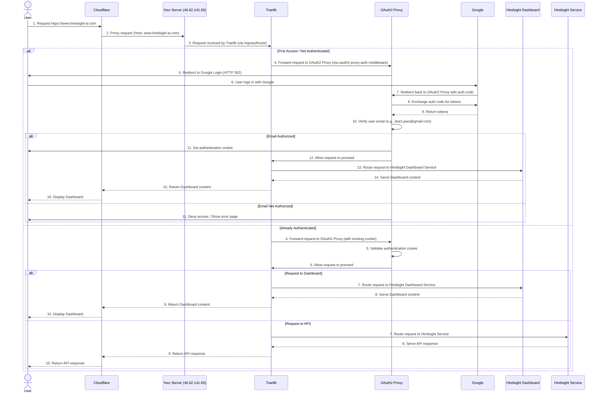

# Hindsight AI Authentication Flow with Cloudflare, Traefik, and OAuth2 Proxy

This diagram illustrates the authentication flow when a user attempts to access your Hindsight AI Dashboard (e.g., `https://www.hindsight-ai.com`) through Cloudflare, protected by `oauth2-proxy` and Google authentication.

**Explanation of the flow:**

1.  **User Request:** The user types `https://www.hindsight-ai.com` into their browser.
2.  **Cloudflare Proxy:** Cloudflare, acting as a reverse proxy (due to the orange cloud DNS setting), intercepts this request. It resolves your domain to your server's IP address (`46.62.141.65`) and forwards the request to your server. Crucially, Cloudflare maintains the original `Host` header (`www.hindsight-ai.com`).
3.  **Traefik Ingress:** Your server receives the request, and Traefik, as your Kubernetes Ingress Controller, picks it up. The `IngressRoute` for `hindsight-dashboard-ingress-domain` matches the `Host` header (`www.hindsight-ai.com`).
4.  **OAuth2 Proxy Middleware:** Before routing the request to the Hindsight Dashboard service, Traefik applies the `oauth2-proxy-auth` middleware. This middleware tells Traefik to send the request to the `oauth2-proxy-service` (internally on port `4180`) for an authentication check.
5.  **Authentication Check (First Access):**
    *   If the user is not authenticated (no valid `oauth2-proxy` cookie), `oauth2-proxy` generates a Google login URL and sends a `302 Redirect` response back to the user's browser.
    *   The user's browser then redirects to Google's authentication page.
    *   After the user successfully logs in with their Google account, Google redirects the user's browser back to `oauth2-proxy`'s callback URL (`https://www.hindsight-ai.com/oauth2/callback`) with an authorization code.
    *   `oauth2-proxy` exchanges this code with Google for user tokens and then verifies the user's email address against the allowed list (e.g., `ibarz.jean@gmail.com`).
    *   If the email is authorized, `oauth2-proxy` sets a secure authentication cookie in the user's browser and then signals Traefik to allow the original request to proceed.
6.  **Authentication Check (Subsequent Access):**
    *   If the user already has a valid `oauth2-proxy` cookie, Traefik still forwards the request to `oauth2-proxy`.
    *   `oauth2-proxy` validates the existing cookie. If valid, it immediately signals Traefik to allow the request to proceed without redirecting to Google.
7.  **Dashboard Access:** Once `oauth2-proxy` authorizes the request, Traefik routes the request to the `hindsight-dashboard-service`. The dashboard serves its content, which is then passed back through Traefik and Cloudflare to the user's browser.

This entire process ensures that only pre-approved Google accounts can access your Hindsight AI Dashboard and API.
