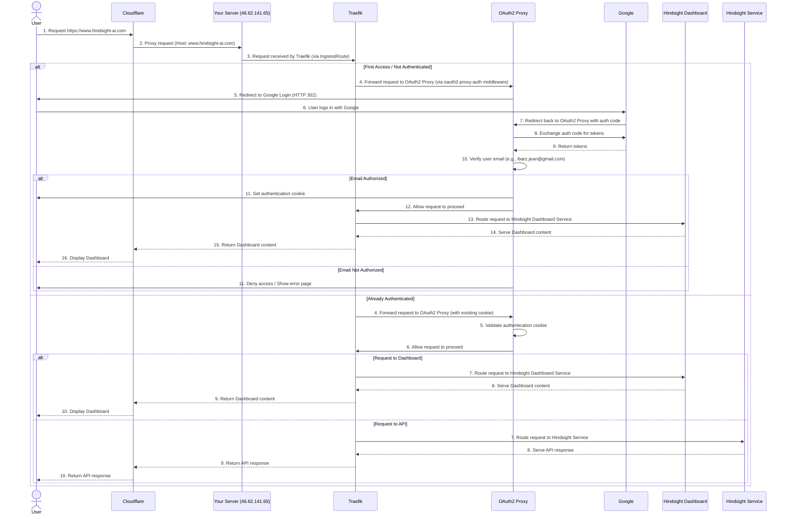

# Hindsight AI Authentication Flow with Cloudflare, Traefik, and OAuth2 Proxy

This diagram illustrates the authentication flow when a user attempts to access your Hindsight AI Dashboard (e.g., `https://www.hindsight-ai.com`) through Cloudflare, protected by `oauth2-proxy` and Google authentication.

**Explanation of the flow:**

1.  **User Request:** The user types `https://www.hindsight-ai.com` into their browser.
2.  **Cloudflare Proxy:** Cloudflare, acting as a reverse proxy (due to the orange cloud DNS setting), intercepts this request. It resolves your domain to your server's IP address (`46.62.141.65`) and forwards the request to your server. Crucially, Cloudflare maintains the original `Host` header (`www.hindsight-ai.com`).
3.  **Traefik Ingress:** Your server receives the request, and Traefik, as your Kubernetes Ingress Controller, picks it up. The `IngressRoute` for `hindsight-dashboard-ingress-domain` matches the `Host` header (`www.hindsight-ai.com`).
4.  **OAuth2 Proxy Middleware:** Before routing the request to the Hindsight Dashboard service, Traefik applies the `oauth2-proxy-auth` middleware. This middleware tells Traefik to send the request to the `oauth2-proxy-service` (internally on port `4180`) for an authentication check.
5.  **Authentication Check (First Access):**
    *   If the user is not authenticated (no valid `oauth2-proxy` cookie), `oauth2-proxy` generates a Google login URL and sends a `302 Redirect` response back to the user's browser.
    *   The user's browser then redirects to Google's authentication page.
    *   After the user successfully logs in with their Google account, Google redirects the user's browser back to `oauth2-proxy`'s callback URL (`https://www.hindsight-ai.com/oauth2/callback`) with an authorization code.
    *   `oauth2-proxy` exchanges this code with Google for user tokens and then verifies the user's email address against the configured domain rules (`OAUTH2_PROXY_EMAIL_DOMAINS`). With the current `*` wildcard, any Google account that completes the flow is accepted.
    *   If the email is authorized, `oauth2-proxy` sets a secure authentication cookie in the user's browser and then signals Traefik to allow the original request to proceed.
6.  **Authentication Check (Subsequent Access):**
    *   If the user already has a valid `oauth2-proxy` cookie, Traefik still forwards the request to `oauth2-proxy`.
    *   `oauth2-proxy` validates the existing cookie. If valid, it immediately signals Traefik to allow the request to proceed without redirecting to Google.
7.  **Dashboard Access:** Once `oauth2-proxy` authorizes the request, Traefik routes the request to the `hindsight-dashboard-service`. The dashboard serves its content, which is then passed back through Traefik and Cloudflare to the user's browser.

This entire process ensures that only Google-authenticated accounts reach your Hindsight AI Dashboard and API, with access controlled via `OAUTH2_PROXY_EMAIL_DOMAINS` (default `*`).

## Beta Access Gate: Post-Login Decisions

OAuth2 establishes *who* the end-user is. A second layer – the beta access gate – determines *what* happens after authentication. Every user record (and any pending invitation) carries a `beta_access_status` with one of four canonical values:

| Status          | Meaning                                                                 | Automatic Redirect |
|-----------------|-------------------------------------------------------------------------|--------------------|
| `not_requested` | Authenticated, but never asked to join the beta.                         | `/beta-access/request` |
| `pending`       | Submitted a request and is awaiting review.                             | `/beta-access/pending` |
| `denied`        | Request was reviewed and declined (includes optional reason).            | `/beta-access/denied` |
| `revoked`       | Previously accepted access was manually rescinded by an administrator.   | `/beta-access/denied` |
| `accepted`      | Granted access to the dashboard and API.                                | `/dashboard` (or previously requested route) |

### End-User Workflow

1. **Authenticate via Google** – described in the previous section.
2. **Fetch session context** – the dashboard loads `/api/user-info`, which now includes the `beta_access_status`.
3. **Client-side router guard** – `App.tsx` checks the status and performs one of the automatic redirects shown above. All protected dashboard routes perform the same gatekeeping to prevent deep-link bypasses.
4. **Request flow** – when a user on the request page submits the form, the backend will:
   - Create or reuse a `beta_access_requests` record.
   - Set their status to `pending`.
   - Send two emails via `NotificationService`:
     * **Request confirmation** to the requester.
     * **Admin review notice** to the configured admins with tokenised accept/deny links.
5. **Email actions** – if the user attempts to access without being accepted yet, they remain on the pending or denied page until an admin decision promotes them to `accepted`.

### Admin Review Workflow

Administrators can act on beta requests from two entry points:

1. **Pending requests screen** – the internal admin UI surfaces outstanding requests and drives the `/beta-access/review/{request_id}` API.
2. **Email token links** – each notification email contains pre-signed links of the form:
   - `https://<APP_HOST>/login?beta_review=<id>&beta_decision=accepted&beta_token=<token>`
   - `https://<APP_HOST>/login?beta_review=<id>&beta_decision=denied&beta_token=<token>`

When an admin visits either link, the login guard processes the parameters after the OAuth cookie is validated:

1. The dashboard calls `POST /beta-access/review/{id}/token`.
2. The backend verifies the token, records the decision, updates the requester’s status, and triggers the appropriate notification (acceptance or denial).
3. The frontend cleans the sensitive query parameters out of the address bar to avoid accidental sharing.
4. A confirmation notification is shown immediately.
5. If the decision was **accepted**, the admin is redirected to `/beta-access/review/granted`, a dedicated confirmation screen that summarises who was approved and offers quick links back to the pending queue or dashboard.

### Idempotent Decisions & Repeat Links

To avoid confusion (or duplicate emails) when an administrator reopens the same token link after acting from the UI:

* The service layer now returns a structured payload including `already_processed` and `request_email`.
* The frontend interprets that signal and routes the admin to the same confirmation page with contextual messaging (“Access already granted”).
* Email notifications are **not** re-sent on repeat approvals, and the audit log records only the first successful decision.

### Manual Overrides & Revocation

Administrators listed in `BETA_ACCESS_ADMINS` (comma-separated emails) can visit `/beta-access/admin` directly (there is no navigation link) to inspect user status and perform manual overrides. Updates are audited as `beta_access_review` entries and support four outcomes:

* `accepted` / `denied` – mirror the standard decision flow and synchronise the most recent request record.
* `revoked` – indicates access was granted previously but has now been intentionally rescinded. Users experience the same gating as `denied`, but audit trails retain the distinction.
* `not_requested` – clears beta status entirely for clean re-testing.

Use this interface only in staging or controlled environments; production allowlists should remain empty unless explicitly required for troubleshooting.

### Summary of Key Decisions

* **Separation of concerns** – Google OAuth2 + Cloudflare/Traefik ensure identity; beta access enforces feature availability.
* **Single source of truth** – `beta_access_requests` records drive both UI state and email content, ensuring users, admins, and auditors see the same status.
* **Resilient email links** – token links are valid exactly once, but replays yield a friendly confirmation instead of a hard error when the request is already processed.
* **Strict HTTPS links** – links in email templates now use `get_app_base_url()` to respect environment overrides (`APP_BASE_URL`/`APP_HOST`) and avoid mixed-content/CORS regressions.
* **Consistent UX across surfaces** – the dashboard enforces the same redirect rules whether the user lands on `/login`, `/dashboard`, or any deep link, preventing circumvention of the beta gate.
