# 00 — Context View

> **Question this view answers:** What is Hindsight AI, what's inside the system boundary, and what's outside?

## Mission

Hindsight AI is a **persistent memory and knowledge-distillation layer for AI agents**. It captures operational memories produced during agent runs, retrieves them on demand, and consolidates similar memories into refined "lessons learned" that improve future behavior.

The system is delivered as a self-hostable Docker Compose stack. Two hosted environments exist — staging and production — both deployed to a single VPS via GitHub Actions.

## System boundary

```mermaid
flowchart LR
    subgraph "External actors"
      End[End user / operator] -- "browser" --> SPA
      AgentMCP[AI agent<br/>MCP-capable] -- "MCP stdio" --> MCP
      AgentHTTP[AI agent / script<br/>direct HTTP + PAT] -- "Bearer or X-API-Key" --> Edge
    end

    subgraph "Hindsight AI (system boundary)"
      direction TB
      Edge[Traefik edge proxy<br/>TLS, routing, rate-limit]
      OAuth[oauth2-proxy<br/>session cookie + headers]
      SPA[Dashboard SPA<br/>React + Vite + Nginx]
      MCP[hindsight-mcp<br/>MCP server, TS]
      API[hindsight-service<br/>FastAPI + workers]
      DB[(PostgreSQL 16<br/>+ pgvector + pg_trgm)]
      Ollama[Ollama<br/>embeddings + small-LLM<br/>query expansion]
    end

    subgraph "External services"
      Google[Google OAuth2]
      Cloudflare[Cloudflare DNS<br/>Let&#39;s Encrypt DNS-01]
      Gemini[Google Gemini API<br/>consolidation LLM]
      Resend[Resend.com<br/>transactional email]
    end

    Edge --> OAuth
    Edge --> API
    OAuth --> SPA
    SPA -- "/api proxy" --> API
    MCP --> API
    API --> DB
    API --> Ollama
    API -- "consolidation worker" --> Gemini
    API -- "email service" --> Resend
    OAuth --> Google
    Edge --> Cloudflare
```

## Components in scope (system boundary)

| Component | Tech | Location | Role |
|---|---|---|---|
| **Dashboard SPA** | React 19, TypeScript, Vite, Tailwind v4 | `apps/hindsight-dashboard/` | Operator UI for memory inspection, organization management, search, beta-access admin, token management. |
| **hindsight-service** | Python 3.13, FastAPI, SQLAlchemy, Alembic | `apps/hindsight-service/` | HTTP API, ORM, audit logging, scoped governance, background workers (consolidation, pruning, async bulk ops), email service. |
| **hindsight-mcp** | TypeScript, MCP SDK | `mcp-servers/hindsight-mcp/` | Bridges MCP-capable agents to the FastAPI backend; injects `agent_id` / `conversation_id` from environment. |
| **PostgreSQL** | pg16 + pgvector + pg_trgm | `infra/postgres/`, `db_data` volume | Single source of truth for memories, agents, users, orgs, audit, notifications. |
| **Ollama** | Local LLM runtime | `ollama_data` volume | Embeddings (default: `nomic-embed-text:v1.5`) + query-expansion LLM (`llama3.2:1b`). Optional; provider can fall back to `mock`. |
| **Traefik** | v3.4.4 | `config/`, prod profile | TLS termination via Cloudflare DNS-01 ACME, host-based routing, three rate-limit middlewares (anon / bearer / apikey). |
| **oauth2-proxy** | v7.6.0, Google IdP | prod profile | Authenticates browser sessions, injects `X-Auth-Request-User` (= OIDC `sub`) and `Authorization: Bearer <id_token>` headers. |
| **hindsight-copilot-assistant** | Next.js | `apps/hindsight-copilot-assistant/` (gated by `copilot` profile) | Optional CopilotKit-based companion UI. Out-of-scope for the core system flows. |

## Components out of scope

- **Cloudflare DNS / Let's Encrypt** — DNS hosting and certificate issuance only.
- **Google OAuth2** — identity provider.
- **Google Gemini API** — consolidation LLM. Failure mode is well-defined: see `docs/architecture.md` "Knowledge Distillation Process" — fallback path uses TF-IDF + cosine similarity but does NOT generate consolidated content.
- **Resend.com** — transactional email delivery (beta-access invitations, organization invitations, membership notifications).
- **GitHub Actions** — CI/CD; runs both test jobs then deploys via SSH + Docker Compose to a single VPS (see ADR-0006).

## Primary actors and their goals

| Actor | Goal | Entry point |
|---|---|---|
| **End user** (browser) | Browse, search, organize memories; manage org membership; create personal access tokens. | `https://app.hindsight-ai.com` → oauth2-proxy → SPA. |
| **Org admin** | Invite/remove members, configure roles, manage org-scoped resources. | SPA, `OrganizationManagement.tsx`. |
| **Beta-access admin** | Approve/deny beta-access requests, send invitations. | SPA, `BetaAccessAdminPage.tsx`. |
| **AI agent (MCP)** | Create/retrieve memory blocks during a conversation; report feedback. | MCP stdio → `hindsight-mcp` → FastAPI. |
| **AI agent (direct HTTP)** | Same as MCP, but via raw HTTP with a Personal Access Token (PAT) or API key. | `https://api.hindsight-ai.com` with `Authorization: Bearer <PAT>` or `X-API-Key: <key>`. Traefik routes these to a separate router with the `rate-limit-bearer` / `rate-limit-apikey` middleware. |
| **Operator / SRE** | Deploy, monitor, restore from backups, run migrations. | SSH to VPS; `infra/scripts/{backup,restore}_db.sh`; GitHub Actions. |

## Three modes of resource visibility

A single concept threads the data, behavioral, and interface views: every governable resource (memory block, agent, keyword, etc.) carries a **visibility scope** with three values, defined in [`apps/hindsight-service/core/utils/scopes.py`](../../apps/hindsight-service/core/utils/scopes.py):

- `personal` — visible only to one user.
- `organization` — visible to members of one organization (with role-gated permissions).
- `public` — read-only to everyone, even unauthenticated guests via `/guest-api`.

The dashboard's `OrganizationSwitcher.tsx` and `OrganizationContext.tsx` model this in the UI as three modes (Personal, an org, Public). Backend enforcement lives in `core/db/scope_utils.py`. Access-control consequences are enumerated in `docs/data-governance-orgs-users.md` and ADR-0003 / ADR-0005.

## Cross-cutting concerns

| Concern | Where |
|---|---|
| **AuthN** (browser) | Google OAuth → oauth2-proxy → `X-Auth-Request-User: ` + `Authorization: Bearer <id_token>` → backend `core/api/auth.py::get_or_create_user`. ADR-0003, ADR-0005. |
| **AuthN** (programmatic) | Personal Access Token (PAT) `Bearer` or API key `X-API-Key`. Stored hashed in `personal_access_tokens` table (migration `7c1a2b3c4d5e`). |
| **AuthZ** (resource scope) | `core/db/scope_utils.py` filters all reads by current scope; `core/utils/role_permissions.py` resolves org-member roles. |
| **Audit** | `core/audit.py` + `audit_logs` table (migration `5bfbd21a9d4d`). |
| **Observability** | `LOG_LEVEL` env, FastAPI default access logs, no structured tracing yet. |
| **Feature flags** | `LLM_FEATURES_ENABLED`, `FEATURE_CONSOLIDATION_ENABLED`, `FEATURE_PRUNING_ENABLED`, `FEATURE_ARCHIVED_ENABLED` — read from env at backend startup; mirrored to dashboard via `VITE_*` build args + runtime `env.js` (ADR-0001). |
| **Search** | Hybrid: full-text (`tsvector`, migration `d65131155346`) + trigram fuzzy (`pg_trgm`, migration `2a9c8674c949`) + pgvector embeddings (migration `8c0f1b2d4a6b`). Optional query expansion via Ollama (`QUERY_EXPANSION_*` env). See `docs/search-retrieval-overview.md`. |

## What this view does NOT cover

- **Module-level dependency direction** → see [01-structural.md](01-structural.md).
- **State transitions** (beta access status, invitations, bulk operations) → see [02-behavioral.md](02-behavioral.md).
- **HTTP/MCP route inventory** → see [03-interfaces.md](03-interfaces.md).
- **Schema details, constraints, scope columns** → see [04-data.md](04-data.md).
- **Per-environment topology** → see [05-deployment.md](05-deployment.md).
