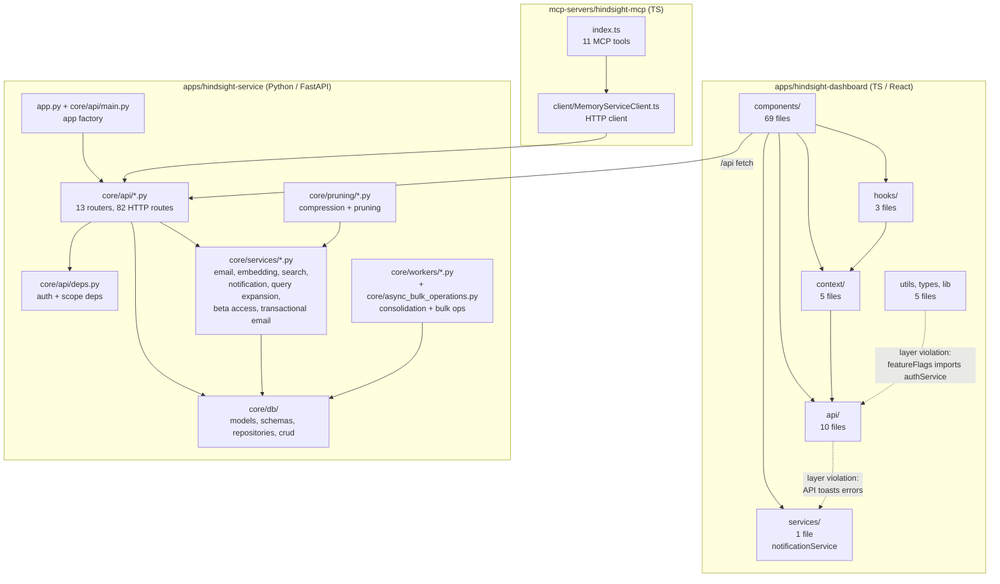
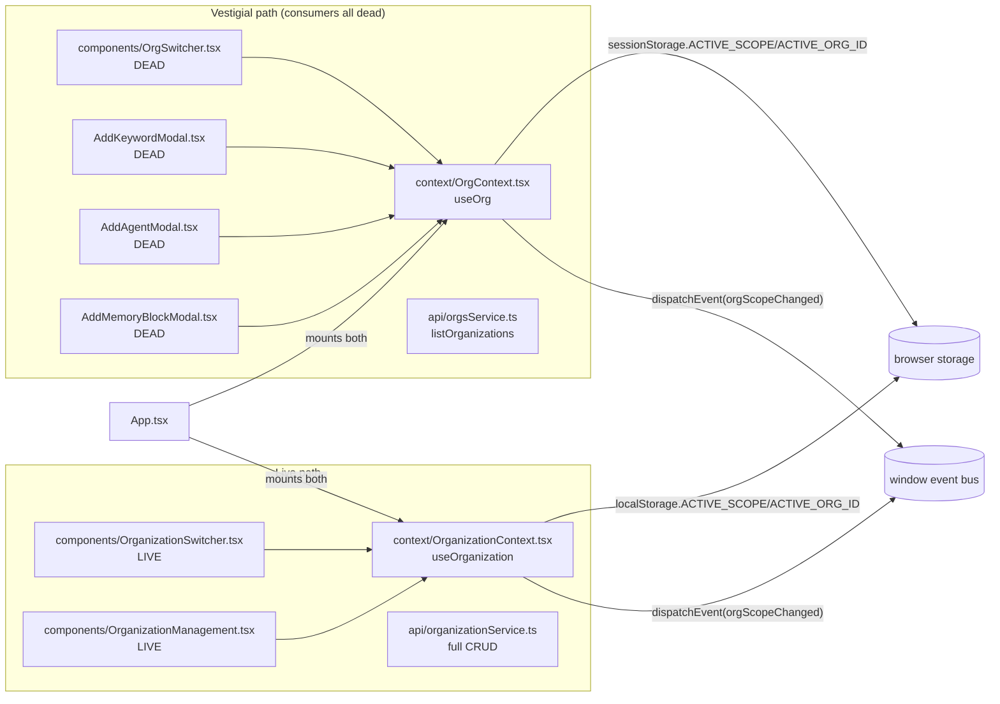

# 01 — Structural View

> **Question this view answers:** What modules exist, how do they depend on each other, and where does the structure diverge from the intent?

This view captures the static decomposition of the codebase. It is grounded in the dependency-graph-analyzer and module-interface-auditor agent runs (2026-04-29). Source files: `/tmp/mbse-research/01-dependency-graph.md` and `/tmp/mbse-research/02-module-interfaces.md`.

## Macro decomposition

## Dashboard frontend — `apps/hindsight-dashboard/src/`

### Layer map

| Layer | Files | Role | Total fan-in | Total fan-out | Instability `I` |
|---|---|---|---|---|---|
| `types/` | 1 | Shared UI type aliases | 15 | 0 | 0.00 |
| `lib/` | 1 | `viteEnv.ts` env accessor | 6 | 0 | 0.00 |
| `services/` | 1 | `notificationService` toast bus | 32 | 0 | 0.00 |
| `api/` | 10 | HTTP service modules | 62 | 13 | 0.17 |
| `context/` | 5 | React contexts | 34 | 8 | 0.19 |
| `utils/` | 3 | Feature flags, dev mode, UUID | 4 | 1 | 0.20 |
| `hooks/` | 3 | Reusable hooks | 10 | 3 | 0.23 |
| `components/` | 69 | Pages, modals, widgets | 98 | 203 | 0.67 |

The graph is a **clean DAG** — Tarjan SCC found 0 cycles across 95 nodes / 262 internal edges. Healthy on the cycle metric.

### Layering violations (4 runtime)

| Violation | Files | Impact |
|---|---|---|
| `api/` → `services/` | `agentService.ts:1`, `memoryService.ts:1`, `organizationService.ts:2` all import `notificationService` | API layer fires toast notifications inline instead of returning structured errors. API modules are not reusable in non-browser contexts and are hard to unit-test without the toast bus. |
| `utils/` → `api/` | `utils/featureFlags.ts:1` imports `CurrentUserInfo` from `api/authService.ts` | Foundation layer depends on a higher layer. Type-only at runtime, but the TS compile dependency exists. Move `CurrentUserInfo` to `types/domain.ts` to fix. |

### Stability/abstractness violations (D-line)

| Module | `I` (instability) | Concern |
|---|---|---|
| `services/notificationService.ts` | 0.00 | Maximally stable but fully concrete (in-browser event bus). 32 dependents tied to the implementation. Replacing the bus requires touching 32 files. **Mitigation:** extract `INotificationService` interface in `types/`. |
| `api/` layer aggregate | 0.17 | 62 afferent deps on concrete HTTP service objects. No interfaces; every component couples to the HTTP implementation. **Blocks unit testing without network mocks.** |

### High fan-in modules (top 10)

`notificationService.ts` (32) → `memoryService.ts` (22) → `AuthContext.tsx` (20) → `domain.ts` (15) → `http.ts` (13) → `agentService.ts` (12) → `Portal.tsx` (12) → `RefreshIndicator.tsx` (8) → `Button.tsx` (7) → `usePageHeader.ts` (7).

These are change magnets — any signature shift cascades through tens of files. The notification service is the most extreme case (32 callers, no interface, no contract).

### High fan-out modules (top 5)

`App.tsx` (33) — router god file directly instantiating 29 page-level components and 4 providers; `MemoryBlockList.tsx` (13, **dead code**); `MemoryOptimizationCenter.tsx` (12); `ArchivedMemoryBlockList.tsx` (11); `MemoryBlocksPage.tsx` (11). The page-level components correctly carry their own breadth — they fetch from multiple APIs and render multiple modals. `App.tsx`'s fan-out is harder to defend because the route table doubles as the provider-tree definition.

### Dead modules (10 files, ~1400 lines)

These files exist but are never imported in production code:

| File | Lines | Why it exists |
|---|---|---|
| `components/MemoryBlockList.tsx` | 671 | Refactored replacement for `MemoryBlocksPage` — comment on line 1 — but never mounted. Has 13 outgoing edges, the second-highest fan-out in the repo. |
| `components/MemoryCompressionModal.tsx` | 381 | Distinct from `MemoryCompactionModal`; imports `MemoryCompactionResult` type from it, but is itself unmounted. |
| `components/AddKeywordModal.tsx` | 143 | Full keyword-creation modal — zero importers. |
| `components/FloatingActionButton.tsx` | 68 | Wraps `AddMemoryBlockModal`; not mounted in `App.tsx` or any page. |
| `components/AddAgentDialog.tsx` | 63 | Stateless presentational version of `AddAgentModal`. Replaced by `AddAgentModal`. |
| `components/OrgSwitcher.tsx` | 60 | Superseded by `OrganizationSwitcher.tsx`. |
| `components/MemoryBlockTable_new.tsx` | — | Cloned `MemoryBlockTable.tsx` with `_new` suffix. |
| `components/MemoryBlockTable_old.tsx` | — | Previous version of same. |
| `components/QuickCreateTokenModal.tsx` | — | Token creation flow superseded by `TokenManagement.tsx`. |
| `utils/devMode.ts` | — | Dev-auth-header helper, only referenced by tests. |

### Dual organization-context architecture

Two parallel context+service pairs both manage organization scope:

**Both providers are mounted in `App.tsx:342-346` and write the same logical key to two different storage backends.** They can drift silently. The vestigial `OrgContext` path has **one live consumer remaining** — `AddAgentModal.tsx`, mounted from `AgentManagementPage.tsx:291`. The other three `useOrg()` consumers (`OrgSwitcher`, `AddKeywordModal`, `AddMemoryBlockModal`→`FloatingActionButton`) are confirmed dead code. Consolidation requires migrating exactly one live component to `useOrganization()` plus deleting the dead path; still small effort.

### Other duplicate / shadow modules

| Pair | Status |
|---|---|
| `MemoryBlockTable.tsx` + `_new.tsx` + `_old.tsx` | Three coexisting variants; `_new` and `_old` not imported. Abandoned refactor. |
| `OrgSwitcher.tsx` + `OrganizationSwitcher.tsx` | Two switchers backed by two contexts (above). |
| `AddAgentDialog.tsx` + `AddAgentModal.tsx` | The dialog is a stateless presentational version. Modal is used. |

## Backend — `apps/hindsight-service/core/`

### Module catalog

| Group | Files | Role | Notable |
|---|---|---|---|
| `core/api` | 18 | FastAPI routers (one per resource), `deps.py`, `main.py` (app factory + overflow endpoints) | `main.py` is **1353 lines** with 18 endpoint definitions + an inline 130-line keyword extraction helper (lines 706–772) |
| `core/db/models` | 11 | SQLAlchemy ORM, domain-split | 20 model classes, clean aggregator |
| `core/db/schemas` | 11 | Pydantic request/response schemas | ~65 classes |
| `core/db/repositories` | 9 | Per-domain DB access (in-progress) | "Phase 3 scaffolding" per `__init__.py:1` — currently delegates back to `crud.py` |
| `core/db/crud.py` | 1 | Monolithic CRUD facade | **975 lines, 75 functions, 8 entity domains** |
| `core/db/database.py` | 1 | Engine/session factory | 2–3 functions |
| `core/services` | 7 | Business services | Inconsistent re-exports in `__init__.py` |
| `core/workers` | 2 | Background tasks | Consolidation worker + async bulk ops |
| `core/pruning` | 2 | LLM compression + pruning | |
| `core/search` | 2 | **Compatibility shim** + evaluation helper | Re-exports from `core.services.search_service` |
| `core/utils` | 6 | Feature flags, role permissions, scope constants, token crypto, URL helpers | |
| `core/core` | 1 | **Documentation-only namespace marker** | Empty `__init__.py` |
| `core/__init__.py` | 1 | Empty package marker | |

### Four god modules

| Module | Size | Role concentration |
|---|---|---|
| `core/db/crud.py` | 943 lines, 75 public functions | Mixes thin DB writes (`create_agent`, 1 line) with multi-step business transactions (`apply_consolidation`, 60 lines). Spans 8 entity domains. The `core/db/repositories/` extraction is the documented intent but is incomplete. |
| `core/api/main.py` | 1333 lines, 18 endpoint definitions | App factory (router registration, CORS, middleware) **plus** direct endpoints for: `/user-info`, `/conversations/count`, `/memory/prune/*`, `/memory-blocks/*/compress*`, `/memory-blocks/bulk-*`, three `/memory-blocks/search/*` typed endpoints. Embeds a 67-line `extract_keywords_enhanced` pure-text-processing helper at lines 686–752. |
| `core/services/notification_service.py` | 1277 lines, 30 methods | Single class handles in-app notifications, user preferences, email-log persistence, async email dispatch, and 7 event-specific flows (org invitation, membership added/removed, role changed, beta-access invitation/confirmation/admin/acceptance/denial). Several methods (e.g. `notify_membership_added` lines 863–977) embed nested closures that mix transactional update logic with email transport. |
| `core/api/deps.py` | ~10 dependency callables, 586 lines | Returns `Tuple[Any, Dict[str, Any]]` — the dict has well-known keys (`id`, `email`, `is_superadmin`, `memberships`, `memberships_by_org`, `pat`, `dev_mode_pat`) consumed by **76 raw `current_user.get(...)` / `current_user[...]` reads across 15 API files**. A typo silently returns `None` and bypasses `is_superadmin` checks — the single security-relevant smell on this view. Replace with `CurrentUserContext` dataclass. |

### Compatibility shims (status — corrected after re-verification)

| Shim | Status |
|---|---|
| `core/search/__init__.py` | **Still load-bearing.** Six production import sites: `core/db/crud.py:615,738,785,833`, `core/db/repositories/memory_blocks.py:19`, `core/search/evaluation.py:13`. Once these migrate to `core.services.search_service`, the shim deletes cleanly. |
| `core/workers/async_bulk_operations.py` | **The shim is dead** — zero production imports. Despite its docstring claiming "the new canonical path", every production caller imports from the root `core/async_bulk_operations.py`. The shim itself is the redundant file; delete it and drop the misleading docstring on the root file. |
| `core/core/consolidation_worker.py` | **Load-bearing for tests** — patched by 7 lines in `tests/integration/memory_blocks/test_consolidation_worker.py` (`@patch('core.core.consolidation_worker.X')`). Production code does not use it. Removal requires retargeting test patches to `core.workers.consolidation_worker` first. |
| `core/core/__init__.py` | **Doc-only**, but the package as a whole is not removable until `consolidation_worker.py` above is migrated. |
| `core/__init__.py` | Empty Python package marker. Keep. |

### Dead backend code

| File | Status | Why |
|---|---|---|
| `core/api/orgs_fixed.py` | Dead | Defines a duplicate organizations router with its own `APIRouter()`. **Never registered in `app.py` or `main.py`.** Its docstring even says "prefer `orgs.py` for current endpoints", yet it persists. |

## Cross-module structural tensions

Three tensions surface from the agent reports and warrant calling out before any refactor.

### 1. The `crud.py` repository extraction is half-done

`core/db/repositories/__init__.py` is labelled "Phase 3 scaffolding" but the per-domain repository functions delegate back to the same monolithic implementations in `crud.py`. The new namespace exists; the migration does not. **A consumer's choice between `core.db.crud.create_memory_block` and `core.db.repositories.memory_blocks.create_memory_block` is purely cosmetic today.** Either complete the migration (move logic, deprecate `crud.py`) or roll back the scaffolding. Holding the half-state encourages drift.

### 2. The dashboard's API layer is not reusable outside the browser

Three of the ten api/ modules (`agentService.ts`, `memoryService.ts`, `organizationService.ts`) call `notificationService.show*Error()` inline instead of returning structured errors. Consequences:
- API modules cannot be reused in a Node test, MCP-server-side environment, or Storybook without stubbing the toast bus.
- Callers cannot distinguish error types programmatically (401 vs 500 vs network) because errors arrive as `Error('...')` strings.
- Unit tests of API modules require mocking the notification bus.

This is a **Class 1 layering violation** — the lower transport layer depends on a higher UI layer. The fix is to make API modules throw structured errors and have a thin "API error → toast" interceptor at a higher layer (e.g., a fetch wrapper or a React Query mutation `onError`).

### 3. The "active organization" boundary has two implementations

`OrgContext` + `orgsService` (vestigial) and `OrganizationContext` + `organizationService` (live) both manage the active-organization concept. Both providers mount in `App.tsx`, write to two different storage backends (`sessionStorage` vs `localStorage`) for the same logical keys, and dispatch the same `orgScopeChanged` event. This is **not an MBSE modeling tension — it is a real bug surface**: any future code that reads from one store and writes to the other can introduce silent divergence. The vestigial path's consumers are all dead; deletion is safe in a single PR.

## See also

- [03-interfaces.md](03-interfaces.md) — public contracts of the modules described here.
- [02-behavioral.md](02-behavioral.md) — runtime state machines that span these modules.
- [06-smells/](06-smells/) — prioritized refactor backlog distilled from the issues above.
