# 02 — Behavioral View

> **Question this view answers:** What state machines and key flows govern runtime behavior?

This view enumerates the **state machines** that exist in the system, both explicit (status enums) and implicit (boolean lifecycles). It distinguishes documented states from coded states and surfaces drift.

Source of truth for the inventory: `/tmp/mbse-research/04-state-machines.md` (state-machine-verifier agent run, 2026-04-29). When the inventory becomes stale, re-run that agent and reconcile.

## State machine catalog

| ID | Owning entity | Storage | States | Documented? | Drift? |
|---|---|---|---|---|---|
| SM-1 | `BetaAccessRequest.status` | `beta_access_requests.status` (TEXT) | 3 | Partly | No |
| SM-2 | `User.beta_access_status` | `users.beta_access_status` (STRING) | 5 | Yes (`docs/authentication_flow.md`) | **Model comment is stale (4-state)** |
| SM-3 | `OrganizationInvitation.status` | `organization_invitations.status` (TEXT) | 4 | Implicit | **Revoke endpoint has no current-state guard** |
| SM-4 | `BulkOperation.status` | `bulk_operations.status` (TEXT) | 5 | Implicit | **Cancel race vs worker commit; no DB re-read** |
| SM-5 | `ConsolidationSuggestion.status` | `consolidation_suggestions.status` (STRING(20)) | 3 | Implicit | No DB-level CHECK constraint |
| SM-6 | `MemoryBlock` lifecycle | `memory_blocks.archived` (BOOLEAN) | 2 | No | Implicit machine; no documented state diagram before this doc |
| SM-7 | `Notification` read state | `notifications.is_read` (BOOLEAN) | 2 | No | None |
| SM-8 | `EmailNotificationLog.status` | `email_notification_logs.status` (STRING(20)) | 5 | No | Unguarded `update_email_status` accepts any string |
| SM-9 | `PersonalAccessToken.status` | `personal_access_tokens.status` (STRING(20)) | 3 | Comment only | **`expired` state is a ghost — never written** |

## SM-1 — Beta Access Request

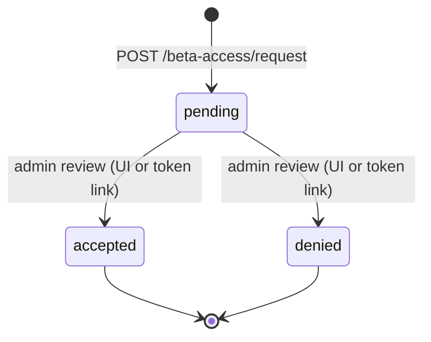

**Implementation**: `apps/hindsight-service/core/services/beta_access_service.py:35,134,152`. **Guard**: `beta_access_service.py:67–69` rejects re-review of non-pending requests, so `accepted` and `denied` are correctly terminal.

## SM-2 — User Beta Access Status

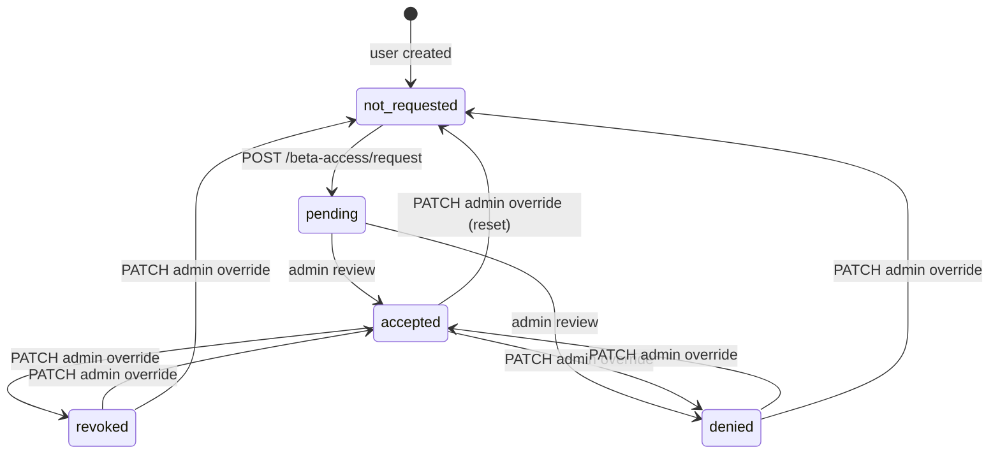

**Implementation**: `core/api/beta_access.py:237–249`, `core/services/beta_access_service.py:39,146,153`.

**Drift — model comment is stale.** `core/db/models/users.py:15` lists `not_requested|pending|accepted|denied`. The fifth state, `revoked`, is reachable via `PATCH /beta-access/admin/users/{id}` (`beta_access.py:249`) and is documented in `docs/authentication_flow.md:84` as redirecting to `/beta-access/denied`. The model comment should be updated to enumerate all five.

**No precondition check on admin override.** Any `PATCH` can transition from any state to any state. Treat the diagram's `any → any` edges as feature, not bug, but flag in the smell backlog if support engineers should not be able to silently move an `accepted` user back to `not_requested` without an audit reason.

## SM-3 — Organization Invitation

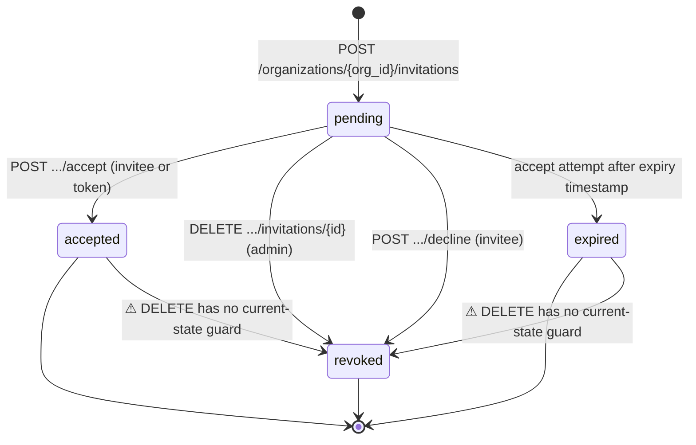

**Implementation**: `core/api/orgs.py:558,637,780,825,856`. DB-level `CHECK` constraint from migration `f59d6b564160` enforces the four-value set.

**Drift — terminal state violation.** `DELETE /organizations/{org_id}/invitations/{invitation_id}` at `orgs.py:780` unconditionally sets `status = 'revoked'`. There is no precondition check that the current status is `pending`. An already-`accepted` invitation can be silently flipped to `revoked`, contradicting the documented terminal-state semantics. The same applies to the `resend` endpoint (`orgs.py:688–760`), which extends `expires_at` and rotates the token without checking the current status.

**Drift — `revoked` collapses two semantically different events.** Both admin revoke (`DELETE`, `orgs.py:780`) and invitee decline (`POST .../decline`, `orgs.py:637`) write `status = 'revoked'`. The audit log distinguishes them (`INVITATION_REVOKE` vs `INVITATION_DECLINE`), but the DB column does not. Any future report that asks "how many invitations were declined?" cannot answer from the `status` column alone.

## SM-4 — Bulk Operation

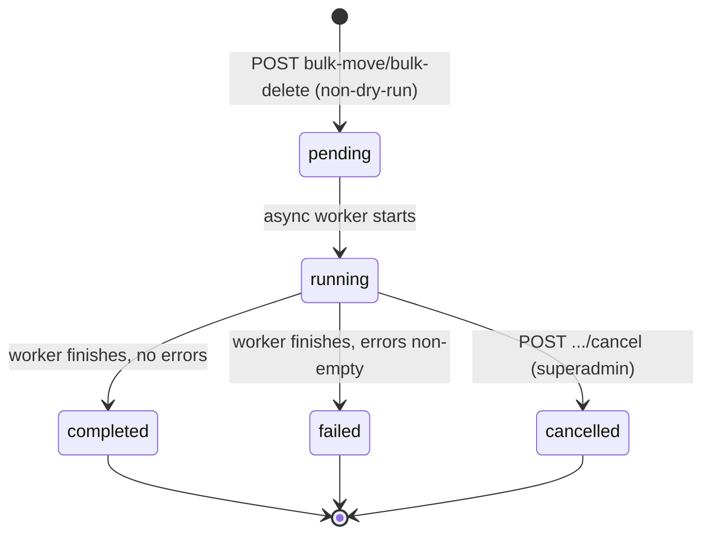

**Implementation**: `core/async_bulk_operations.py:61,82,117,132`, `core/api/bulk_operations.py:244,328,427`.

**Drift — cancellation vs worker-commit race.** `bulk_operations.py:427` writes `status = 'cancelled'` based on the result of `cancel_task`, which checks the in-memory `_running_tasks` registry, not the DB. If the worker has already crossed its terminal `db.commit()` (e.g. `async_bulk_operations.py:88`) just before the cancel API runs, the DB record will be `completed` or `failed` but the API returns "Operation cancelled successfully". There is no re-read after cancel to reconcile.

**Drift — in-memory failure not persisted.** `async_bulk_operations.py:329` (`_on_task_complete`) writes `{"status": "failed"}` to the in-memory `_task_results` registry on exception. The DB status update lives inside `_perform_bulk_*`. If an exception escapes those methods (e.g. DB connection drop), the DB stays `running` while the registry says `failed` — silent divergence.

## SM-5 — Consolidation Suggestion

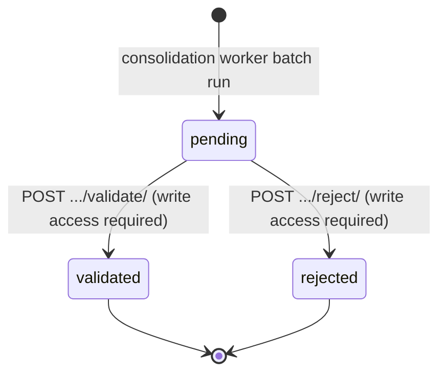

**Implementation**: `core/workers/consolidation_worker.py:315`, `core/api/consolidation.py:181,219,273,292`, `core/db/crud.py:597–609`.

**Side effect of `validate`.** `crud.apply_consolidation` archives every original `MemoryBlock` (sets `archived=True`, `archived_at=now`) and creates a new merged block — this is the cleanest **cross-machine trigger** in the system, driving SM-6 transitions on the originals.

**Drift — no DB-level CHECK constraint.** Migration `975d4a80651a` declared the column as `STRING(20)` with no constraint. Only the SQLAlchemy `default='pending'` and the Python guards enforce the value set. Raw-SQL inserts could create rows with any status string.

## SM-6 — MemoryBlock Lifecycle

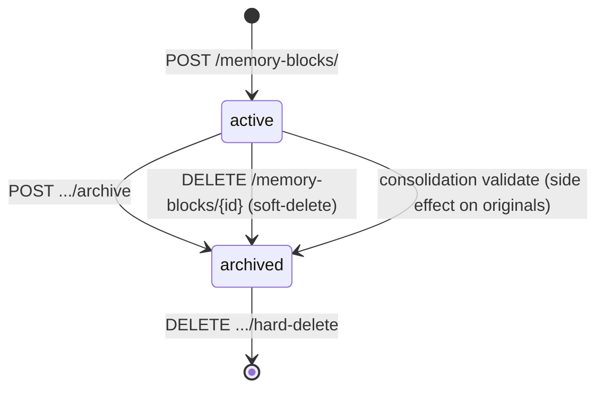

**Implementation**: `core/api/memory_blocks.py:136,411,447,479`, `core/db/crud.py:601–602` (consolidation side effect).

**Implicit machine.** No enum, no documented state diagram before this view. The `archived` boolean and the related `archived_at` timestamp (added in migration `456789012345`) are the entire state. There is **no `unarchive` path** — once archived, a block stays archived until hard-deleted.

The orthogonal dimension — `visibility_scope` (`personal | organization | public`) — is not part of this lifecycle; it's a permissioning attribute described in the [data view](04-data.md).

## SM-7 — Notification Read State

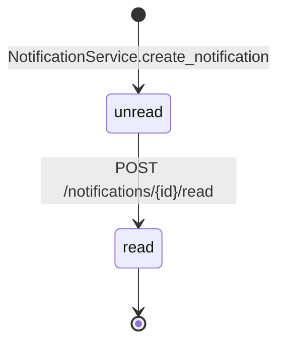

**Implementation**: `core/services/notification_service.py:260`, `core/api/notifications.py:74`.

Trivial two-state toggle. **Gap**: no bulk-mark-all-read endpoint, despite `/notifications/stats` exposing `unread_count`.

## SM-8 — Email Notification Log

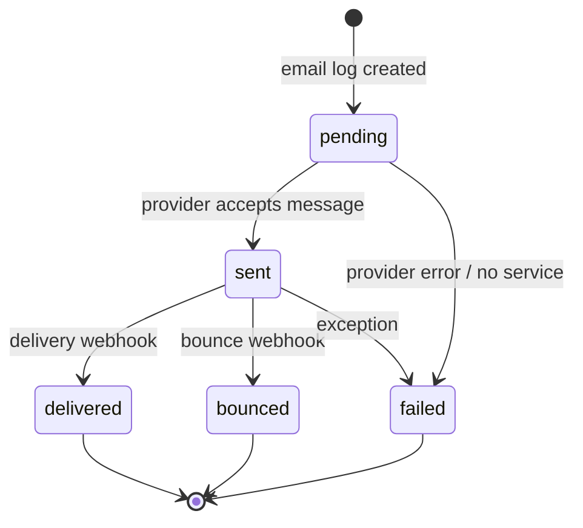

**Implementation**: `core/services/notification_service.py:275,309,311,313,388,390,443,456,588,597,923,949,963,965,967,975`.

**Drift — unguarded `update_email_status`.** `notification_service.py:275` accepts any `status` string and writes it without checking the current value. A `delivered` record could be reset to `failed` if a caller had access to the method. No public API endpoint exposes this directly, so the production risk is contained — but the helper itself is overly permissive.

## SM-9 — Personal Access Token

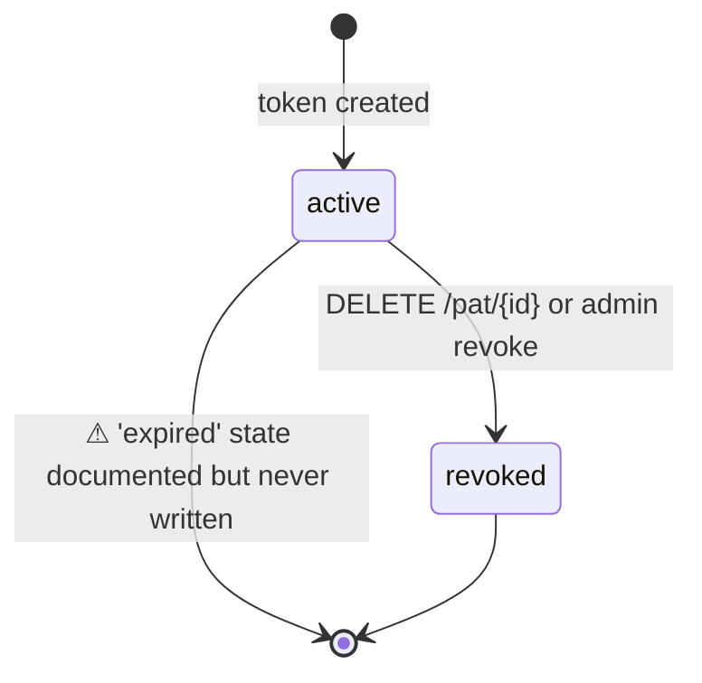

**Implementation**: `core/db/models/tokens.py:25`, `core/db/repositories/tokens.py:83–84`, `core/api/deps.py:257` (validation-time check).

**Drift — `expired` is a ghost state.** The model comment lists `active|revoked|expired`, but no code path writes `status = 'expired'`. Expiry is enforced at validation time by comparing `expires_at < now()` and returning HTTP 400; the DB row stays `active` indefinitely. **Consequence**: a query for `status='expired'` returns zero rows, even when many tokens have actually expired. Either remove `expired` from the model comment or add a sweep job that materializes the transition.

## Cross-cutting flows (high-level)

These are not single state machines but multi-component flows worth pinning down for the architecture conversation. Each links primary state machines that must coordinate.

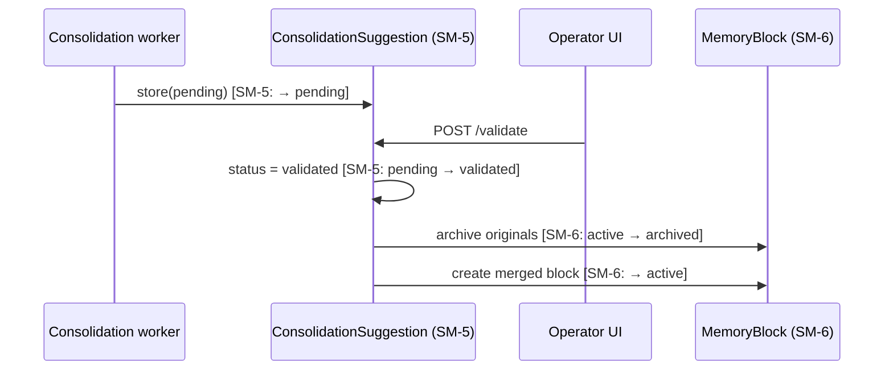

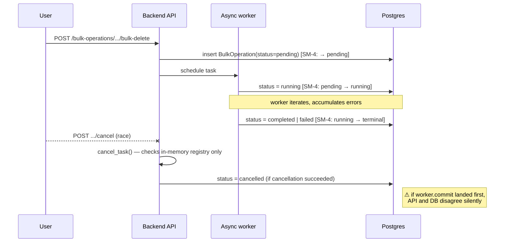

## Cross-cutting findings (raw)

1. **Two channels collapse to one state — invitation decline vs revoke.** Different audit-log action types, same `status='revoked'` value. Future reporting will need the audit log to distinguish them.
2. **No background expiry sweep.** Invitations expire only on accept-attempt; PATs never transition. Dashboards showing "pending" counts include silently-expired records unless the UI checks `expires_at`.
3. **Boolean lifecycles are real state machines.** `archived` and `is_read` should be treated as first-class machines in any test plan that exercises lifecycle (e.g., the consolidation flow that archives originals as a side effect).
4. **In-memory state vs persisted state can diverge** in the bulk-operations flow under cancellation or worker exception. Operators reading the DB get one truth, the API returns another.

## See also

- [04-data.md](04-data.md) — schema details and constraints for each state column.
- [03-interfaces.md](03-interfaces.md) — the HTTP endpoints that drive these transitions.
- `docs/authentication_flow.md` — narrative description of the beta-access flow (SM-1 + SM-2).
