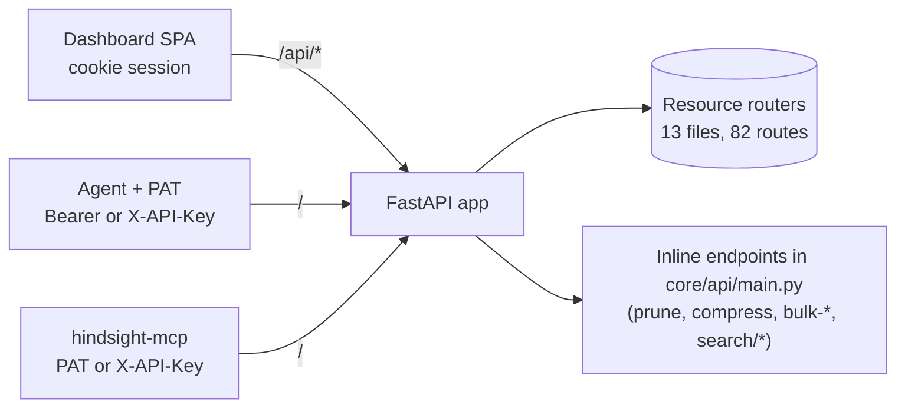

# 03 — Interface View

> **Question this view answers:** What contracts exist at module/process boundaries, and where do they drift?

This view inventories the three external API surfaces of Hindsight AI:

1. **HTTP** — FastAPI routers in `apps/hindsight-service/core/api/`. **82 routes across 13 router files.**
2. **MCP** — TS server at `mcp-servers/hindsight-mcp/src/index.ts`. **11 tools.**
3. **Frontend → Backend** — what the dashboard *expects* the backend to return, and where its expectations drift.

Source of truth: `/tmp/mbse-research/03-api-surface.md` (api-surface-auditor agent run, 2026-04-29).

## HTTP surface (overview)



### Auth schemes per endpoint group

| Group | Prefix | Predominant auth | Notable carve-outs |
|---|---|---|---|
| `core/api/main.py` (inline) | none | `either` (oauth2-proxy headers OR PAT) | **6 mutating endpoints have NO auth dependency** (see drift below) |
| `memory_blocks.py` | `/memory-blocks` | `either` | search endpoints accept anonymous (optional auth) |
| `agents.py` | `/agents` | `either` | |
| `keywords.py` | `/keywords` | `either` | |
| `organizations.py` | `/organizations` | **oauth only** — PAT not accepted | invitation accept/decline accept token-based fallback |
| `users.py` | `/users` | oauth only | |
| `audits.py` | `/audits` | oauth + org or superadmin | |
| `consolidation.py` | mixed | `either` for read | **`POST /consolidation/trigger/` and `DELETE /consolidation-suggestions/{id}` have NO auth dep** |
| `bulk_operations.py` | `/bulk-operations` | oauth | superadmin-gated cancel/list |
| `notifications.py` | `/notifications` | oauth | superadmin-gated cleanup |
| `support.py` | none | `/build-info`: none, `/support/contact`: oauth | |
| `beta_access.py` | `/beta-access` | beta-admin or oauth | `POST /beta-access/review/{id}/token` is unauthenticated by design (email click-through) |
| `memory_optimization.py` | `/memory-optimization` | `either` | preview endpoint has no auth dep |

### `Authorization` and scope header propagation

The dashboard ↔ backend ↔ MCP triangle uses three headers consistently:

| Header | Purpose | Set by | Read by |
|---|---|---|---|
| `Authorization: Bearer <id_token>` (oauth) or `Bearer hsp_<token>` (PAT) | Identity | oauth2-proxy (browser); PAT bearer (MCP / scripts) | `core/api/auth.py:resolve_identity_from_headers` (oauth) or `core/api/deps.py:get_current_user_context_or_pat` (PAT) |
| `X-API-Key: hsp_<token>` | Programmatic identity (alternative to Bearer) | clients with API key | `get_current_user_context_or_pat` |
| `X-Active-Scope` | `personal` / `organization` / `public` | dashboard `apiFetch` (sessionStorage); MCP `MemoryServiceClient` constructor (env) | `core/api/main.py:144–174` middleware enforces non-PAT writes |
| `X-Organization-Id` | Organization UUID when scope is `organization` | same | same |

A subtle inconsistency: `memoryService.ts:141–142` reads scope from `sessionStorage` and **adds it as a query param** for `getConsolidationSuggestions`, while other paths rely on the auto-header injection. The backend middleware accepts both forms, so this works — but the inconsistency is fragile.

`get_current_user_context` (used by orgs / audits / notifications / bulk-ops / support / beta-access / users) accepts **only** oauth2-proxy headers — it does **not** fall back to PAT. PAT holders therefore cannot use most management endpoints. Whether this is intentional should be confirmed.

### CORS

`core/api/main.py:83–97`:
- `allow_origins`: `localhost:3000`, `localhost:8000`, `localhost`, `app.hindsight-ai.com`, `app-staging.hindsight-ai.com`.
- `allow_credentials=True`, `allow_methods=["*"]`, `allow_headers=["*"]`. Wildcard headers allow `X-Active-Scope`, `X-Organization-Id`, `X-API-Key`, `X-CSRF-Token`. Correct shape for cookie-based auth (no wildcard origin).

## HTTP route inventory (compact)

The full route list is in `/tmp/mbse-research/03-api-surface.md` §1. The headline numbers:

- **82 HTTP routes**, 13 router files.
- **15 routes lack a Pydantic `response_model`** — return raw `dict` / `list`. Handlers in `orgs.py` are the largest cluster.
- **9 routes accept untyped `dict` request bodies** — concentrated in the `main.py` inline cluster.
- **6 mutating routes have no auth dependency at all** beyond the global guest-write middleware (see drift below).

## MCP tool inventory

Source: `mcp-servers/hindsight-mcp/src/index.ts`. **11 tools, all backed by HTTP calls** to the FastAPI backend.

| Tool | Backend endpoint(s) | Notes |
|---|---|---|
| `create_memory_block` | `POST /memory-blocks/` | Resolves `agent_id` from `DEFAULT_AGENT_ID` env; auto-generates `conversation_id`. |
| `create_agent` | `POST /agents/` | Injects org scope from env. |
| `retrieve_relevant_memories` | `GET /memory-blocks/search/` | Converts keyword array → CSV. |
| `retrieve_all_memory_blocks` | `GET /memory-blocks/` | Returns filtered subset `{content, errors, timestamp}`. |
| `retrieve_memory_blocks_by_conversation_id` | `GET /memory-blocks/` | Defaults `conversation_id` from env. |
| `report_memory_feedback` | `POST /memory-blocks/{id}/feedback/` | Maps `memory_block_id` arg → `memory_id` payload field. |
| `get_memory_details` | `GET /memory-blocks/{id}` | Returns same filtered subset. |
| `search_agents` | `GET /agents/search/` | Returns full agent objects. |
| `advanced_search_memories` | `GET /memory-blocks/search/{fulltext,semantic,hybrid}` | Routes by `search_type`. **`search_type='basic'` silently routes to `searchHybrid`.** |
| `show_capture_checklist` | (none — local) | Returns static text. |
| `whoami` | `GET /user-info` | Returns full payload. |

Auth: `HINDSIGHT_API_TOKEN` (Bearer) or `HINDSIGHT_API_KEY` (X-API-Key). Scope set at construction time via `HINDSIGHT_ACTIVE_SCOPE` and `HINDSIGHT_ORGANIZATION_ID` env vars; **scope cannot change per-request** in the MCP path.

### MCP type-safety gaps

- `index.ts:413` dispatches with `typedArgs: Record<string, any>`. Type guards validate at runtime but do not narrow TS types.
- `MemoryServiceClient.searchFulltext/Semantic/Hybrid` declare return type `MemoryBlock[]`; backend actually returns `MemoryBlockWithScore[]` with extra `search_score`, `search_type`, `rank_explanation`. Extra fields are silently dropped.
- `MemoryServiceClient.MemoryBlock` types `id` as optional; backend always returns it.

## Dashboard ↔ backend contract drift (top issues)

### 1. Two backend endpoints called by the dashboard do not exist

| Dashboard call | Reality |
|---|---|
| `memoryService.mergeMemoryBlocks` → `POST /memory-blocks/merge` (line 175) | No such route in any backend router. **Returns 404.** |
| `memoryService.suggestKeywords` → `POST /memory-blocks/{id}/suggest-keywords` (line 158) | No such route. **Returns 404.** Backend's nearest equivalent is the bulk endpoint `POST /memory-blocks/bulk-generate-keywords`. |

Both will fail at the network layer. The dashboard features that depend on them ("Merge Memory Blocks" and per-block "Suggest Keywords") are broken.

### 2. `MemoryBlock` dashboard type is a 5-field stub

Dashboard `memoryService.ts:50` declares:
```ts
interface MemoryBlock { id: string; agent_id: string; content: string; visibility_scope?: string; organization_id?: string | null; }
```

Backend `core/db/schemas/memory.py::MemoryBlock` returns 19+ fields including `conversation_id`, `errors`, `lessons_learned`, `metadata_col`, `feedback_score`, `retrieval_count`, `archived`, `archived_at`, `owner_user_id`, `content_embedding`, `timestamp`, `created_at`, `updated_at`, `keywords[]`. Most `memoryService` methods cast `resp.json()` untyped, so the mismatch only bites at the few call sites that consume the typed return value of `getMemoryBlockById`.

### 3. `CurrentUserInfo` missing `dev_mode_pat` and `pat`

The backend `/user-info` returns `dev_mode_pat` (raw token string) in dev-mode responses and a `pat` object when authenticated by PAT. The dashboard's `CurrentUserInfo` interface in `authService.ts:14–22` declares neither. The dashboard does its own dev-auth header construction in `utils/devMode.ts` rather than reading the backend-provided token, so this is mostly cosmetic — but if the dashboard ever wanted to use the backend's dev token, it could not type the field.

### 4. `agentService.getAgents` defends against a paginated response that is never returned

Dashboard at `agentService.ts:36-39`:
```ts
if (data && Array.isArray(data.items)) return data as PaginatedAgents;
if (Array.isArray(data)) return { items: data } as PaginatedAgents;
```
The backend `GET /agents/` returns a flat array (`response_model=List[Agent]`). The dual-path is defensive code for an outcome that never materializes; `PaginatedAgents.total_items` is always undefined for this endpoint.

### 5. `notifications.metadata` ↔ `metadata_json` impedance mismatch

The Pydantic schema field is `metadata`. The SQLAlchemy column is `metadata_json` (because `.metadata` collides with SQLAlchemy's mapper attribute). The handler patches the attribute at runtime in three places (`notifications.py:48,104` plus `adapted_recent`). **Any future handler that forgets to call this patch will serialize `metadata` as `null`.** This is a load-bearing fragility.

### 6. `OrganizationMembership.organization_name` populated inconsistently

The dashboard interface marks `organization_name` as optional. The backend's `get_user_memberships` (`auth.py:223`) does include it, but the cached membership dict built in `get_current_user_context` may omit `organization_name` when constructed without joining the `Organization` table. The org switcher dropdown can show blank names if a stale cache is hit.

## High-severity routing/auth issues

### 6 mutating endpoints have no auth dependency

The following routes accept `request: dict` bodies and have no `Depends(...)` for auth — they are protected only by the global `enforce_readonly_for_guests` middleware, which checks for *any* auth header but does not validate it for these routes:

| Route | File | Severity |
|---|---|---|
| `POST /memory/prune/suggest` | `core/api/main.py:458` | High |
| `POST /memory/prune/confirm` | `core/api/main.py:484` | High |
| `POST /memory-blocks/{id}/compress` | `core/api/main.py:528` | High |
| `POST /memory-blocks/bulk-generate-keywords` | `core/api/main.py:642` | High |
| `POST /memory-blocks/bulk-apply-keywords` | `core/api/main.py:797` | High |
| `POST /memory-blocks/bulk-compact` | `core/api/main.py:858` | High |
| `POST /consolidation/trigger/` | `core/api/consolidation.py:29` | High — triggers LLM consolidation worker |
| `DELETE /consolidation-suggestions/{id}` | `core/api/consolidation.py:325` | High — destructive |

Each should add `Depends(get_current_user_context_or_pat)` at minimum, and a Pydantic request model for type safety.

### `GET /bulk-operations/admin/operations/{id}` is shadowed

`bulk_operations.py:267-276` registers a route that always returns 403. `bulk_operations.py:350-377` registers a superadmin-typed handler for the **same path**. FastAPI uses first-match — the typed superadmin handler is unreachable.

**Open question:** was the always-403 stub a deliberate pause (e.g. work-in-progress) or an accidental double-registration? The route catalog should either remove one of them or document the dormant state explicitly.

### Three search endpoints duplicate auth resolution

`/memory-blocks/search/{fulltext,semantic,hybrid}` in `core/api/main.py` perform manual auth resolution (~30 lines each) duplicating `get_current_user_context_or_pat`. The duplicated resolvers do **not** call `ensure_pat_allows_read` and do **not** apply `apply_optional_scope_narrowing`. PAT organization restrictions are partially enforced but scope narrowing is skipped.

## Test coverage gaps (from coverage map)

Most routes have integration or unit tests. Notable gaps:

- `DELETE /consolidation-suggestions/{id}` — no test for unauthorized delete (the auth gap above is therefore untested).
- `GET /bulk-operations/admin/operations/{id}` (superadmin handler) — unreachable due to shadowing, so untestable end-to-end.
- `POST /memory-blocks/{id}/compress/apply` — partial coverage; the apply path is not exercised independently of the `compress` test.
- `/memory-blocks/merge` and `/memory-blocks/{id}/suggest-keywords` — the dashboard calls them, but the backend has no implementation, so there is nothing to test.

## See also

- [01-structural.md](01-structural.md) — module decomposition and god modules behind these interfaces.
- [02-behavioral.md](02-behavioral.md) — state machines driven by these endpoints.
- [04-data.md](04-data.md) — how endpoint payloads map to persistence.
