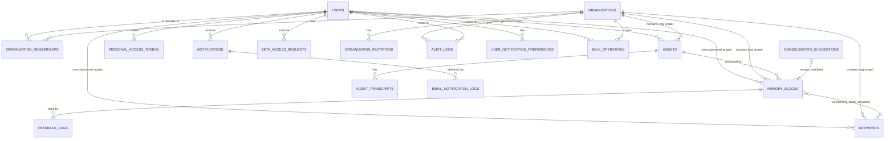
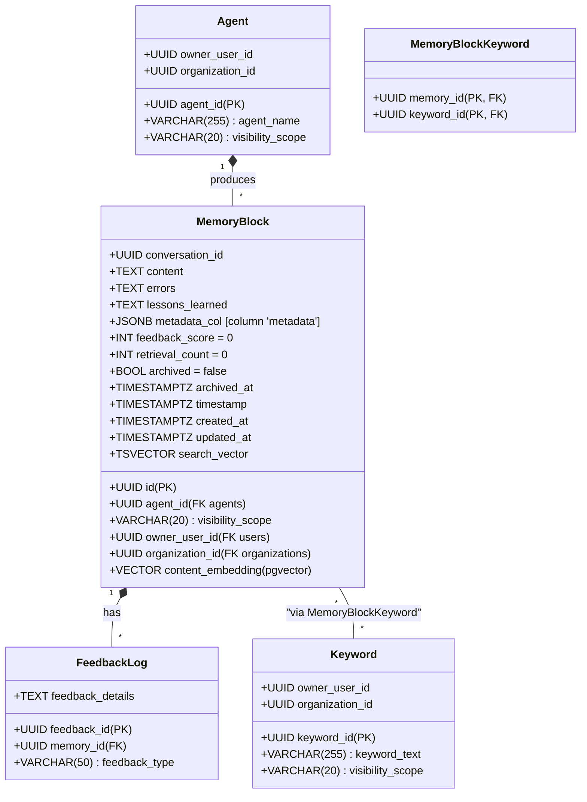

# 04 — Data View

> **Question this view answers:** What is persisted, how is it scoped, how does it migrate, and what invariants does the schema enforce?

This view is grounded in the SQLAlchemy ORM (`apps/hindsight-service/core/db/models/`), the Alembic migration chain (`apps/hindsight-service/migrations/versions/`), and the scope-utility module (`core/db/scope_utils.py` + `core/utils/scopes.py`).

## Storage

A **single PostgreSQL 16** instance with two extensions:

| Extension | Used by | Migration |
|---|---|---|
| `pgvector` | `memory_blocks.content_embedding` (semantic search) | `8c0f1b2d4a6b_switch_content_embedding_to_pgvector.py` |
| `pg_trgm` | `memory_blocks.search_vector` (fuzzy / trigram fallback) | `2a9c8674c949_add_pg_trgm_extension_for_fuzzy_search.py` |

There is no separate cache or message broker. Background work (consolidation, async bulk ops) coordinates via the `consolidation_suggestions` and `bulk_operations` tables plus in-process `asyncio` task registries (see [02-behavioral.md](02-behavioral.md) §SM-4).

## Schema overview

## Visibility scope — the cross-cutting governance dimension

Four tables carry the `visibility_scope` column:

| Table | Allowed values | Default | DB-level enforcement |
|---|---|---|---|
| `agents` | `personal`, `organization`, `public` | `personal` | None at DB level (only Python `String(20)` + ORM default) |
| `memory_blocks` | same | `personal` | **`CHECK ck_memory_blocks_visibility_scope`** in model `__table_args__` |
| `keywords` | same | `personal` | **`CHECK ck_keywords_visibility_scope`** in model `__table_args__` |
| `consolidation_suggestions` | n/a | n/a | Suggestions are not directly scope-tagged; the merged result is created with the scope of the originals (see `crud.apply_consolidation`) |

Constants live in `core/utils/scopes.py:11-29`:
- `SCOPE_PUBLIC = "public"`
- `SCOPE_ORGANIZATION = "organization"`
- `SCOPE_PERSONAL = "personal"`
- `VisibilityScopeEnum` (Pydantic-friendly Enum)

Read-side enforcement: `core/db/scope_utils.py::apply_scope_filter(query, current_user, model)`:

| Scope | Filter rule (non-superadmin) |
|---|---|
| `public` | always visible |
| `personal` | `owner_user_id = current_user.id` |
| `organization` | `organization_id IN user_orgs` |

Superadmin sees all. Optional **scope narrowing** (`apply_optional_scope_narrowing`) further restricts based on the request's `X-Active-Scope` and `X-Organization-Id` headers — e.g. a request with `X-Active-Scope: organization, X-Organization-Id: <uuid>` further narrows the base filter to just that org.

Backfill of existing rows: migration `20240915_backfill_scope_fields.py` populated `visibility_scope`, `owner_user_id`, and `organization_id` for pre-governance rows. Constraints and indexes were added in `20240915_scope_check_constraints.py` and `20240915_scope_constraints_indexes.py`. PostgreSQL row-level security policies were added by `20240915_rls_policies.py` (the only ORM-independent enforcement layer).

## Tables (catalog)

### Identity and access

| Table | Owning model | Purpose | State machine |
|---|---|---|---|
| `users` | `User` | Identity, email, OIDC subject, beta status, superadmin flag | [SM-2](02-behavioral.md#sm-2--user-beta-access-status) |
| `organizations` | `Organization` | Org name, slug, active flag | — |
| `organization_memberships` | `OrganizationMembership` | (user, org, role, can_read, can_write); `CHECK role IN ('owner','admin','editor','viewer')` | — |
| `organization_invitations` | `OrganizationInvitation` | pending/accepted/revoked/expired invites; partial-unique on pending status (per migration `f59d6b564160`) | [SM-3](02-behavioral.md#sm-3--organization-invitation) |
| `personal_access_tokens` | `PersonalAccessToken` | Hashed PAT records with optional org scoping | [SM-9](02-behavioral.md#sm-9--personal-access-token) |
| `beta_access_requests` | `BetaAccessRequest` | Beta-access workflow request records (with one-time review tokens) | [SM-1](02-behavioral.md#sm-1--beta-access-request) |

### Memory domain

| Table | Owning model | Purpose | State machine |
|---|---|---|---|
| `agents` | `Agent` | AI agent identifier; scope-governed | — |
| `agent_transcripts` | `AgentTranscript` | Append-only transcript blobs per agent + conversation | — |
| `memory_blocks` | `MemoryBlock` | Conversational/operational memories; full-text index, embedding column, archived flag | [SM-6](02-behavioral.md#sm-6--memoryblock-lifecycle) |
| `feedback_logs` | `FeedbackLog` | Memory-block feedback (positive/negative/neutral) | — |
| `keywords` | `Keyword` | Scope-governed keyword vocabulary | — |
| `memory_block_keywords` | `MemoryBlockKeyword` | Association table | — |
| `consolidation_suggestions` | `ConsolidationSuggestion` | LLM-generated merge proposals with review state | [SM-5](02-behavioral.md#sm-5--consolidation-suggestion) |

### Notifications

| Table | Owning model | Purpose | State machine |
|---|---|---|---|
| `notifications` | `Notification` | In-app notification queue per user | [SM-7](02-behavioral.md#sm-7--notification-read-state) |
| `user_notification_preferences` | `UserNotificationPreference` | Per-user, per-event-type opt-in toggles (email + in-app) | — |
| `email_notification_logs` | `EmailNotificationLog` | Send-attempt / delivery / bounce records | [SM-8](02-behavioral.md#sm-8--email-notification-log) |

### Operations and audit

| Table | Owning model | Purpose | State machine |
|---|---|---|---|
| `bulk_operations` | `BulkOperation` | Async bulk move/delete jobs | [SM-4](02-behavioral.md#sm-4--bulk-operation) |
| `audit_logs` | `AuditLog` | Append-only action log; (organization_id, actor_user_id, action_type, status, target) | — |

## MemoryBlock — the central entity

Indexes (from `core/db/models/memory.py:42-50`):

- `idx_memory_blocks_agent_id`, `idx_memory_blocks_conversation_id`, `idx_memory_blocks_timestamp`
- `idx_memory_blocks_archived_at`
- `idx_memory_blocks_owner_user_id`
- **`idx_memory_blocks_org_scope`** (composite: `organization_id`, `visibility_scope`) — supports the org-scoped read filter
- `CheckConstraint` enforcing scope ∈ `{'personal','organization','public'}`

Search columns:
- `search_vector` (TSVECTOR) — added by migration `d65131155346`. `tsvector` is maintained by a DB trigger.
- `content_embedding` (pgvector `VECTOR`) — added by migration `8c0f1b2d4a6b`, switched from prior raw-text representation.

## State columns at a glance

| Table | Column | Type | DB CHECK? | Drift |
|---|---|---|---|---|
| `users` | `beta_access_status` | STRING | None | Model comment lists 4 states; code reaches 5 (`revoked` reachable, missing from comment) |
| `beta_access_requests` | `status` | TEXT | None | Consistent |
| `organization_invitations` | `status` | TEXT | **CHECK** in migration `f59d6b564160` | Revoke endpoint has no current-state guard; decline collapses into `revoked` |
| `personal_access_tokens` | `status` | VARCHAR(20) | None | `expired` documented but never written by any code path |
| `bulk_operations` | `status` | TEXT | None | Cancel-vs-worker-commit race; no DB re-read |
| `consolidation_suggestions` | `status` | VARCHAR(20) | **None** | No DB constraint; raw SQL could insert any string |
| `email_notification_logs` | `status` | VARCHAR(20) | None | Internal helper accepts any string |
| `memory_blocks` | `archived` | BOOLEAN | n/a | Implicit two-state machine; no `unarchive` path |
| `notifications` | `is_read` | BOOLEAN | n/a | Trivial toggle |

See [02-behavioral.md](02-behavioral.md) for full state-machine diagrams and the precise list of drift items to address.

## Migration timeline

The Alembic chain (head `20240915_merge_heads.py` resolves a fork from the scoped-governance branch). Notable revisions in chronological order:

| Revision | Adds | Notes |
|---|---|---|
| `a17d8c8efa28` | Base schema | Pre-governance |
| `c90352561e56` | Initial schema (alt) | |
| `bdec54c35ae4` | `memory_blocks.archived` | Boolean lifecycle introduced |
| `5bfbd21a9d4d` | `audit_logs` | Append-only audit |
| `d65131155346` | `memory_blocks.search_vector` (TSVECTOR) | Full-text search |
| `2a9c8674c949` | `pg_trgm` extension | Trigram / fuzzy |
| `975d4a80651a` | `consolidation_suggestions` | LLM merge proposals |
| `85f1accd00c7` | `bulk_operations` | Async bulk ops table |
| `225790e00d26` | Align `metadata` column + indexes on memory_blocks | Reserved-word collision fix |
| `14cd01c502f8` | Rename `memory_id` → `id` in memory_blocks | |
| `456789012345` | `archived_at` timestamp | Augments `archived` boolean |
| `57a3b3cd5572` | `retrieval_count` | |
| `251ad5240261` | Fix `search_vector` column type | |
| `3f0b9c7a1c00` | users / orgs + scoping columns | Scope governance start |
| `20240915_merge_heads` | (merge) | Resolves the scoping fork |
| `20240915_scope_check_constraints` | CHECK on scope columns | DB-level scope validation |
| `20240915_scope_constraints_indexes` | Indexes for scope filters | |
| `20240915_backfill_scope_fields` | Backfill existing rows | |
| `20240915_rls_policies` | Postgres row-level security | |
| `f59d6b564160` | `organization_invitations` | + CHECK on status |
| `39b55ecbd958` | Notification system tables | `notifications`, `user_notification_preferences`, `email_notification_logs` |
| `58d9df7d9301` | `beta_access_requests` | |
| `6b3f2b7f1c23` | Beta-access review tokens | |
| `7c1a2b3c4d5e` | `personal_access_tokens` | |
| `8c0f1b2d4a6b` | Switch `content_embedding` to pgvector | |
| `20250916_convert_organization_invitation_event_type` | Notification taxonomy fix | |
| `2026042900_users_external_subject_unique` | OIDC-sub uniqueness | Latest |

Trigger: backend container's startup runs `alembic upgrade head` (see [05-deployment.md](05-deployment.md)).

## Persistence boundaries (what's NOT in Postgres)

| Concern | Where stored | Notes |
|---|---|---|
| Active scope (browser) | `sessionStorage.ACTIVE_SCOPE`, `sessionStorage.ACTIVE_ORG_ID` (`OrgContext`) **and** `localStorage.{same keys}` (`OrganizationContext`) | Two storages for one logical key — see [01-structural.md](01-structural.md) §"Dual organization-context architecture". |
| In-flight bulk-op tasks | `core/async_bulk_operations.py::_running_tasks` (in-memory dict) | Lost on backend restart; the DB record reflects the last persisted status. Recovery model is implicit. |
| Embeddings | `memory_blocks.content_embedding` (pgvector) | Fallback to TF-IDF cosine in `core/services/embedding_service.py` when provider is `mock` or unavailable. |
| Search query expansion variants | Computed at request time via Ollama or local stemming | Not persisted. |
| Email templates | `core/templates/email/*.html` + `*.txt` | File system only. |
| OAuth session | oauth2-proxy cookie on `.hindsight-ai.com` | Cookie-based; no server-side session table. |

## Persistent-state risks (called out for the smell backlog)

1. **No DB CHECK on `consolidation_suggestions.status`** — only ORM enforces the value set. Raw-SQL inserts can create invalid statuses.
2. **`bulk_operations.status` and worker in-memory state can diverge** under cancellation or worker exception (see [02-behavioral.md](02-behavioral.md) §SM-4).
3. **No background expiry sweep** — invitations and PATs accumulate "logically expired" rows that still report as `pending` / `active`.
4. **Two browser storages for active scope** — the `OrgContext` vs `OrganizationContext` split persists scope to both `sessionStorage` and `localStorage` in different code paths.
5. **`metadata`/`metadata_json` patching** — three handlers manually copy the column; a fourth handler that forgets to will silently serialize `null`.

## See also

- [02-behavioral.md](02-behavioral.md) — state machines for the status columns above.
- [03-interfaces.md](03-interfaces.md) — endpoint payloads vs schema shape (e.g. `MemoryBlock` 5-field stub vs 19-field reality).
- [05-deployment.md](05-deployment.md) — backup/restore scripts and migration triggers.
- `docs/data-governance-orgs-users.md` — narrative description of the scope model.
- `docs/search-retrieval-overview.md` — how `search_vector` and `content_embedding` are used at query time.
