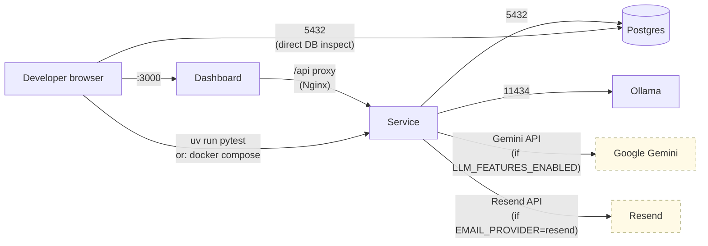
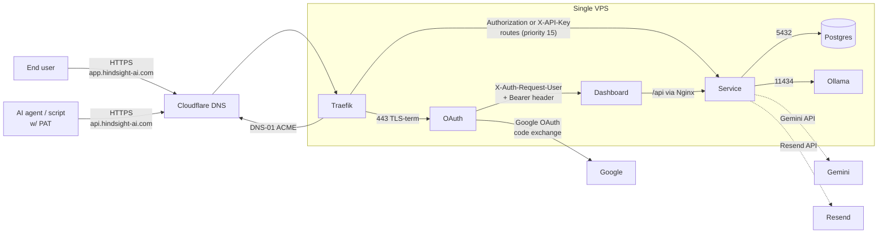
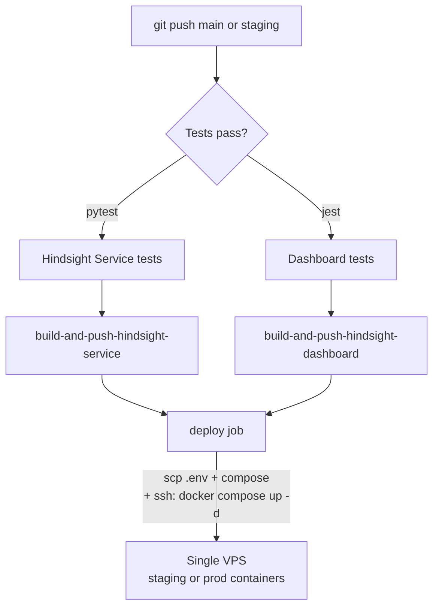

# 05 — Deployment View

> **Question this view answers:** What runs where, in dev / staging / prod? How does code reach a running container?

## Three deployment topologies

| Topology | Compose files | Profile(s) | Edge proxy | Auth proxy | TLS |
|---|---|---|---|---|---|
| **Local dev** | `docker-compose.yml` + `docker-compose.dev.yml` | none | none — host ports exposed | none — `ALLOW_LOCAL_DEV_AUTH=true` | none |
| **Local prod-mirror** | `docker-compose.yml --profile prod` | `prod` | Traefik | oauth2-proxy | self-signed / Let's Encrypt staging |
| **Hosted (staging or prod)** | `docker-compose.app.yml` (deploy.yml writes `.env`) | none (different file) | Traefik | oauth2-proxy | Let's Encrypt prod (DNS-01 via Cloudflare) |

ADR-0002 explains why a single `docker-compose.app.yml` is used for both hosted environments and parameterized only by the `.env` file written at deploy time.

## Local-dev topology

Container roles:
- `db` — pgvector/pgvector:pg16, healthcheck via `pg_isready`, port `5432` exposed to host (dev only).
- `hindsight-service` — port `8000` exposed; `ALLOW_LOCAL_DEV_AUTH=true` enables a local fallback in `/user-info` so the dashboard works without oauth2-proxy.
- `hindsight-dashboard` — port `3000` exposed; Nginx proxies `/api` to `hindsight-service:8000` (no Traefik / oauth2-proxy in dev).
- `ollama` — port `11434` exposed; `ollama_data` volume.

`./start_hindsight.sh` is the canonical entry point. `./start_hindsight.sh --watch` activates Compose's `develop.watch` (Compose v2.21+) for rebuild-on-change.

## Hosted topology (staging and production)

Routing details (from `docker-compose.yml` Traefik labels):

| Hostname | Router rule | Backend | Middlewares |
|---|---|---|---|
| `app.hindsight-ai.com` | (default) | `hindsight-dashboard:80` | (via oauth2-proxy upstream) |
| `app.hindsight-ai.com` | `PathPrefix(/oauth2)` | `oauth2-proxy:4180` | — |
| `app.hindsight-ai.com` | `PathPrefix(/api)` | `oauth2-proxy:4180` (then dashboard `/api` proxy → service) | — |
| `traefik.hindsight-ai.com` | (default) | Traefik dashboard (`api@internal`) | — |
| `api.hindsight-ai.com` | (default) | `hindsight-service:8000` | `cors-headers`, `secure-headers`, `rate-limit-anon` |
| `api.hindsight-ai.com` | `HeadersRegexp(Authorization, ^Bearer\s+.+)`, prio 15 | `hindsight-service:8000` | `rate-limit-bearer` |
| `api.hindsight-ai.com` | `HeadersRegexp(X-API-Key, .+)`, prio 15 | `hindsight-service:8000` | `rate-limit-apikey` |
| `api-staging.hindsight-ai.com` | (same triplet) | same | same |

Staging uses **single-level** subdomains because Cloudflare Universal SSL doesn't cover two-level wildcards (ADR-0004) — i.e., `app-staging.hindsight-ai.com`, not `app.staging.hindsight-ai.com`.

## CI/CD

Workflow: `.github/workflows/deploy.yml`. Triggered by pushes to `main` and `staging`.

- Concurrency: `group: deploy-${{ github.ref }}`, `cancel-in-progress: true` (ADR-0006). Only the most recent push for a branch deploys.
- Image tags: SHA + `latest` (for `main`) or `staging-latest` (for `staging`).
- Environment selector: `${{ github.ref == 'refs/heads/main' && 'production' || 'staging' }}` — same job, different GitHub Actions environment, different secrets.
- Deploy step: `scp` the rendered `.env` and the `docker-compose.app.yml` to `${{ secrets.SSH_HOST }}`, then `ssh: docker compose -f docker-compose.app.yml up -d`.

## Persistent state

| Volume | Mount | Backed up by | Restore by |
|---|---|---|---|
| `db_data` | `/var/lib/postgresql/data` | `infra/scripts/backup_db.sh` (timestamped SQL dump w/ Alembic revision in filename, 100 most recent kept) | `infra/scripts/restore_db.sh` (drops and recreates `hindsight_db`) |
| `ollama_data` | `/root/.ollama` | not backed up — model weights re-downloadable | manual `ollama pull` |
| `letsencrypt/` | `traefik:/letsencrypt` | not backed up — certs re-issuable | restart Traefik to re-issue |

## Migrations

- Engine: Alembic. Single chain rooted at `a17d8c8efa28_base_revision_for_initial_schema.py`, plus a merge head at `20240915_merge_heads.py` resolving the scoped-governance branch.
- Trigger: backend container's startup runs `alembic upgrade head`. Restore script no longer reapplies migrations after restoring a dump (the dump already includes schema).
- Latest revisions on staging: `20240915_rls_policies`, `2026042900_users_external_subject_unique`, `8c0f1b2d4a6b_switch_content_embedding_to_pgvector`.

## Configuration surface

| Variable | Component | Where defaulted |
|---|---|---|
| `DATABASE_URL` | service | composed from `POSTGRES_*` in compose |
| `LLM_API_KEY`, `LLM_MODEL_NAME` | service (Gemini) | `.env` |
| `EMBEDDING_PROVIDER` (`mock` / `ollama`) | service | `.env` |
| `OLLAMA_BASE_URL`, `OLLAMA_EMBEDDING_MODEL` | service | `.env` |
| `LLM_FEATURES_ENABLED`, `FEATURE_CONSOLIDATION_ENABLED`, `FEATURE_PRUNING_ENABLED`, `FEATURE_ARCHIVED_ENABLED` | service + dashboard (mirrored as `VITE_*`) | `.env` |
| `EMAIL_PROVIDER`, `RESEND_API_KEY`, `FROM_EMAIL`, … | service | `.env` |
| `OAUTH2_PROXY_*`, `CLOUDFLARE_DNS_*` | edge | `.env` (production only) |
| `HINDSIGHT_SERVICE_API_URL` | dashboard | runtime via `env.js` (ADR-0001) |
| `BETA_ACCESS_ADMINS`, `ADMIN_EMAILS` | service | `.env` |

ADR-0001 captures the rationale for **runtime** vs build-time config in the dashboard: same image, all environments, configured at container start.

## Out of scope

- Vertical / horizontal scaling — single VPS today, no orchestrator.
- Disaster recovery beyond the SQL dump scripts.
- Multi-region or read-replica topology.
- Kubernetes — `infra/helper_scripts/` contains `kubectl` helpers but no manifests are committed.

## See also

- ADR-0002 — single Compose file with env-scoped secrets
- ADR-0003 — Traefik / oauth2-proxy / Nginx layering
- ADR-0004 — single-level subdomains for staging
- ADR-0006 — workflow concurrency and image tagging
- `docs/traefik_troubleshooting.md` — incident playbook
