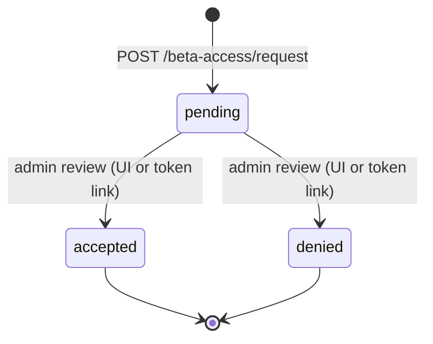
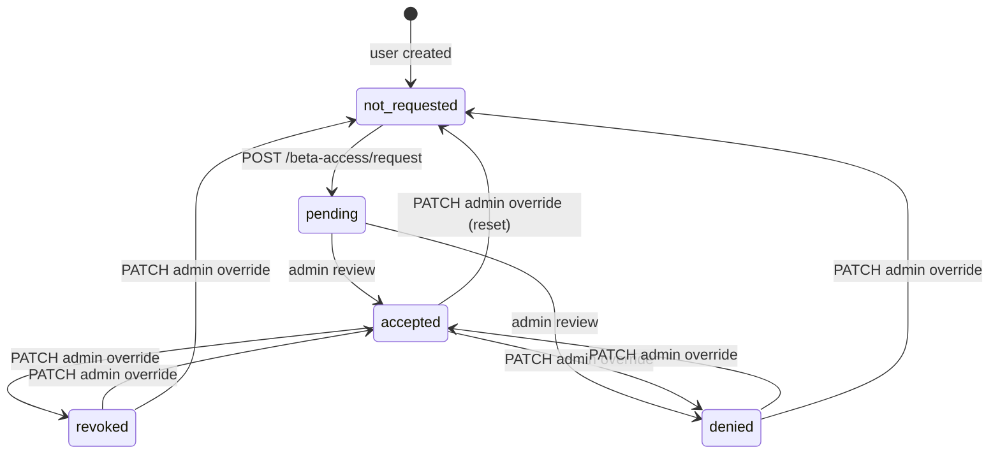
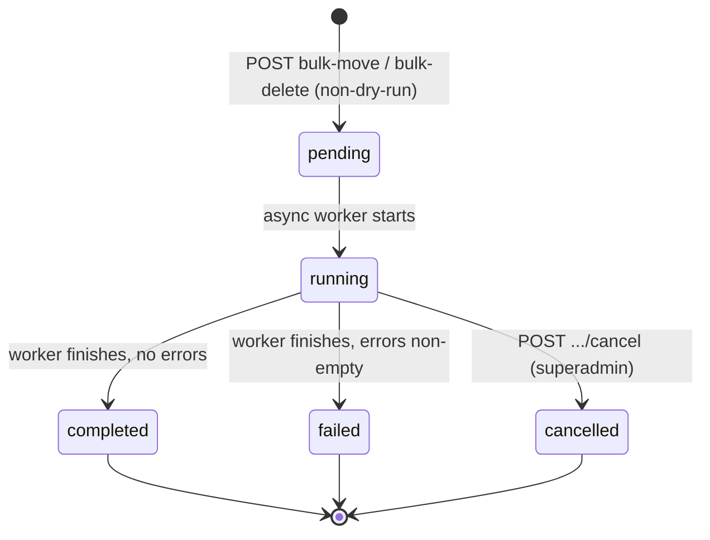
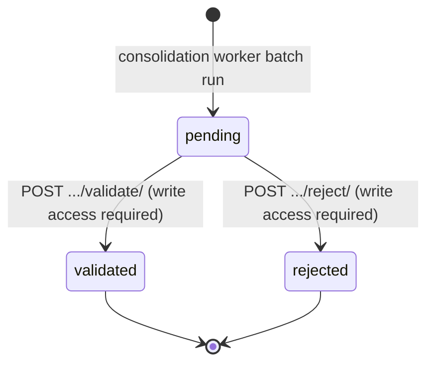
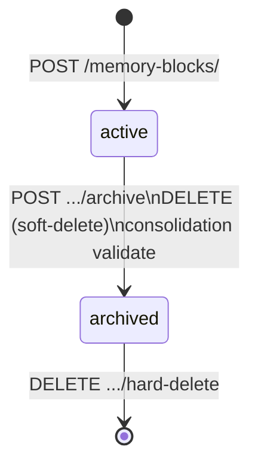
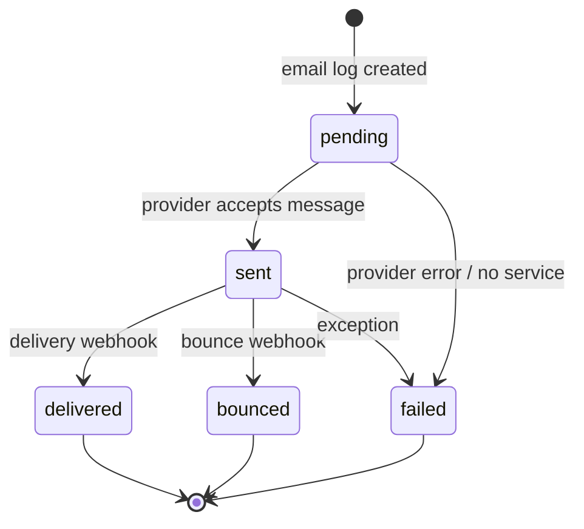
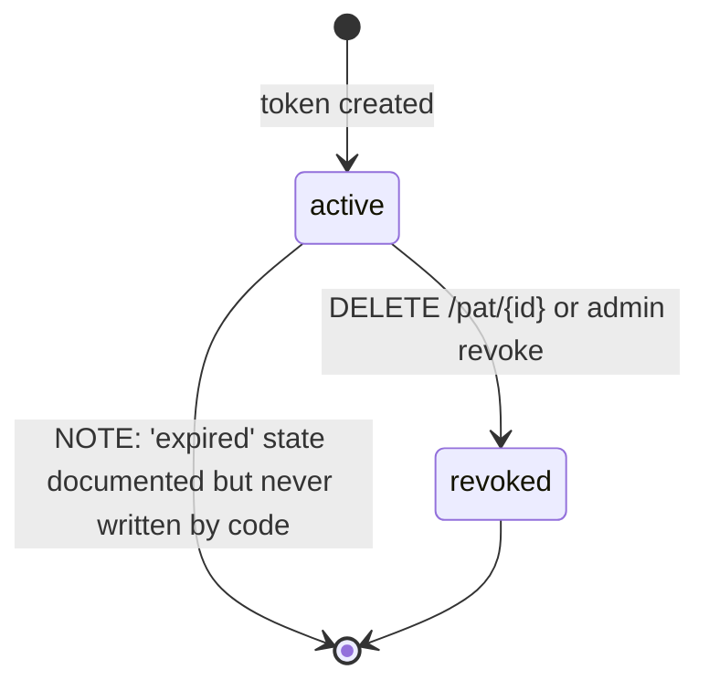

# State Machine Catalog — Hindsight AI
<!-- Research output for MBSE docs initiative. Do not edit directly. -->

## SM-1: Beta Access Request (BetaAccessRequest entity)

**Owning table**: `beta_access_requests`
**State field**: `status TEXT` (column comment: `pending|accepted|denied`)
**Initial state**: `pending` (default on creation)

### States (code)
| State | Source |
|-------|--------|
| `pending` | `core/db/models/beta_access.py:12` default |
| `accepted` | `core/services/beta_access_service.py:144` |
| `denied` | `core/services/beta_access_service.py:152` |

### Transitions
| From | To | Trigger | File:line |
|------|----|---------|-----------|
| — | `pending` | `POST /beta-access/request` (user submits form) | `beta_access_service.py:35` |
| `pending` | `accepted` | `POST /beta-access/review/{id}` (admin, UI) or `POST /beta-access/review/{id}/token` (admin, email link) | `beta_access_service.py:134` |
| `pending` | `denied` | same two endpoints, decision="denied" | `beta_access_service.py:152` |

### Terminal states
`accepted` and `denied` are terminal for the *request record*. The guard at `beta_access_service.py:67–69` rejects any attempt to re-review a non-pending request. No outgoing code path exits either terminal state.

### Doc-vs-code drift
- **Doc lists `pending` as request-record state** (`authentication_flow.md:83`). Code model comment confirms only `pending|accepted|denied`. **Consistent.**
- The migration `58d9df7d9301` bootstrapped existing rows with server default `'pending'`, not `'not_requested'` — this only affects the *User.beta_access_status* field (see SM-2), not the request record itself. OK.

---

## SM-2: User Beta Access Status (User entity)

**Owning table**: `users`
**State field**: `beta_access_status STRING` (column comment: `not_requested|pending|accepted|denied`)
**Initial state**: `not_requested` (Python default; migration bootstrapped existing rows as `'pending'` — see drift note)

### States (code)
| State | Source |
|-------|--------|
| `not_requested` | `core/db/models/users.py:16` |
| `pending` | `beta_access_service.py:39` |
| `accepted` | `beta_access_service.py:146` |
| `denied` | `beta_access_service.py:153` |
| `revoked` | `core/api/beta_access.py:237` (admin manual override only) |

### Transitions
| From | To | Trigger | File:line |
|------|----|---------|-----------|
| — | `not_requested` | user record creation | `users.py:16` |
| `not_requested` | `pending` | `POST /beta-access/request` | `beta_access_service.py:39` / `41` |
| `pending` | `accepted` | admin review (both paths) | `beta_access_service.py:146` |
| `pending` | `denied` | admin review (both paths) | `beta_access_service.py:153` |
| any | `accepted` | `PATCH /beta-access/admin/users/{id}` (manual override) | `beta_access.py:249` |
| any | `denied` | same endpoint | `beta_access.py:249` |
| any | `revoked` | same endpoint | `beta_access.py:249` |
| any | `not_requested` | same endpoint (status-reset) | `beta_access.py:249` |

### Doc-vs-code drift — MAJOR
`authentication_flow.md:84` documents `revoked` as a valid user status and states it redirects to `/beta-access/denied`. The `users.py:15` *comment* lists only `not_requested|pending|accepted|denied` — **`revoked` is absent from the model comment** though the column accepts any string. The `PATCH` admin endpoint at `beta_access.py:237` explicitly allows `revoked` in `allowed_statuses`. The doc is correct; the model comment is incomplete.

### Additional drift
`authentication_flow.md:127` says the admin console supports four outcomes: `accepted`, `denied`, `revoked`, `not_requested`. Code confirms all four at `beta_access.py:237`. Consistent with doc; inconsistent with model comment.

### Terminal states
None. The `PATCH /beta-access/admin/users/{id}` endpoint can transition from any state to any state without precondition check beyond "is it a valid value". An `accepted` user can be moved back to `not_requested` without an audit trail beyond the `BETA_ACCESS_REVIEW` log.

---

## SM-3: Organization Invitation (OrganizationInvitation entity)

**Owning table**: `organization_invitations`
**State field**: `status TEXT` (comment: `pending|accepted|revoked|expired`)
**Initial state**: `pending`

### States (code)
| State | Source |
|-------|--------|
| `pending` | `organizations.py:40` default; `orgs.py:541–547` |
| `accepted` | `orgs.py:856` |
| `revoked` | `orgs.py:637` (invitee decline), `orgs.py:780` (admin revoke) |
| `expired` | `orgs.py:825` (lazy — set during accept attempt if past expiry) |

### Transitions
| From | To | Trigger | File:line |
|------|----|---------|-----------|
| — | `pending` | `POST /organizations/{org_id}/invitations` | `orgs.py:558` via `repositories/organizations.py:162` |
| `pending` | `accepted` | `POST .../invitations/{id}/accept` (invitee or token) | `orgs.py:856` |
| `pending` | `revoked` | `DELETE .../invitations/{id}` (admin revoke) | `orgs.py:780` |
| `pending` | `revoked` | `POST .../invitations/{id}/decline` (invitee decline) | `orgs.py:637` |
| `pending` | `expired` | `POST .../invitations/{id}/accept` when `now > expires_at` | `orgs.py:825` |

### Terminal states
`accepted`, `revoked`, and `expired` are all terminal. Guard at `orgs.py:814` rejects accept if not `pending`. Guard at `orgs.py:633` rejects decline if not `pending`. The revoke endpoint (`DELETE`) has **no guard** — it unconditionally sets `status = 'revoked'` even if the invitation is already `accepted` or `expired`.

### Unguarded transition — MAJOR
`DELETE /organizations/{org_id}/invitations/{invitation_id}` (`orgs.py:762–793`) sets `status = 'revoked'` with no precondition check on the current status. An already-`accepted` or `expired` invitation can be silently flipped to `revoked`. This is a terminal-state violation: `accepted` is documented as terminal but code permits an exit from it.

### Doc-vs-code drift
- The doc (`authentication_flow.md`) does not describe this machine explicitly. The migration `f59d6b564160` has a `CHECK` constraint at the DB layer (`pending|accepted|revoked|expired`), which matches the model comment and the code.
- The `resend` endpoint (`orgs.py:688–760`) rotates the token and extends `expires_at` but does **not** reset status. It only works on `pending` invitations in practice (the invite email is resent), but the endpoint itself has **no status guard** — it will happily extend expiry on an already-`accepted` invitation.

```mermaid
stateDiagram-v2
    [*] --> pending : POST /organizations/{org_id}/invitations
    pending --> accepted : POST .../accept (invitee or token)
    pending --> revoked : DELETE .../invitations/{id} (admin)
    pending --> revoked : POST .../decline (invitee)
    pending --> expired : accept attempt after expiry timestamp
    accepted --> [*]
    revoked --> [*]
    expired --> [*]
    note right of accepted : WARNING — revoke endpoint has no guard;\n accepted → revoked path exists in code
```

---

## SM-4: Bulk Operation (BulkOperation entity)

**Owning table**: `bulk_operations`
**State field**: `status TEXT` (comment: `pending|running|completed|failed|cancelled`)
**Initial state**: `pending` (default on creation)

### States (code)
| State | Source |
|-------|--------|
| `pending` | `bulk_ops.py:14` default |
| `running` | `async_bulk_operations.py:61,117` |
| `completed` | `async_bulk_operations.py:82,132` |
| `failed` | `async_bulk_operations.py:82,132` |
| `cancelled` | `bulk_operations.py:427` (API) |

### Transitions
| From | To | Trigger | File:line |
|------|----|---------|-----------|
| — | `pending` | `POST /bulk-operations/organizations/{org_id}/bulk-move` or `bulk-delete` | `bulk_operations.py:244,328` via `crud.create_bulk_operation` |
| `pending` | `running` | async worker `_perform_bulk_move` / `_perform_bulk_delete` start | `async_bulk_operations.py:61,117` |
| `running` | `completed` | worker finishes with no errors | `async_bulk_operations.py:82,132` |
| `running` | `failed` | worker finishes with errors list non-empty | `async_bulk_operations.py:82,132` |
| `running` | `cancelled` | `POST /bulk-operations/admin/operations/{id}/cancel` (superadmin) | `bulk_operations.py:427` |

### Unguarded transitions — MAJOR
1. `cancel_task` in `async_bulk_operations.py:351` calls `task.cancel()` (Python asyncio cancellation) and returns `True` if the task exists in `_running_tasks`. The DB update (`operation.status = 'cancelled'`) at `bulk_operations.py:427` runs only if `cancelled=True`. However, if `_perform_bulk_move` is already past the `db.commit()` at line 88 when cancellation fires, the DB record will be `completed`/`failed` but the API returns "Operation cancelled successfully". No re-read from DB after cancellation to reconcile.
2. There is no guard preventing a `PATCH` to set `status='running'` on an already-`completed` operation — but no such endpoint exists in the API either, so this is not practically exploitable.

### Terminal states (documented)
`completed`, `failed`, `cancelled` are effectively terminal — no code path transitions away from them.

### Impossible-but-coded path
`async_bulk_operations.py:_on_task_complete` (line 329) writes `{"status": "failed"}` to `_task_results` for exceptions but never writes that to the DB. The DB status update lives inside `_perform_bulk_*`. If an exception escapes those methods (e.g. DB connection drop), the DB record stays `running` forever while `_task_results` says `failed`. Status drift between in-memory cache and DB.

---

## SM-5: Consolidation Suggestion (ConsolidationSuggestion entity)

**Owning table**: `consolidation_suggestions`
**State field**: `status STRING(20)` (no comment in model; values inferred from code)
**Initial state**: `pending`

### States (code)
| State | Source |
|-------|--------|
| `pending` | `consolidation_worker.py:315`, `memory.py:81` default |
| `validated` | `consolidation.py:219`, `crud.py:606` |
| `rejected` | `consolidation.py:292` |

### Transitions
| From | To | Trigger | File:line |
|------|----|---------|-----------|
| — | `pending` | consolidation worker `store_consolidation_suggestions` | `consolidation_worker.py:315` |
| `pending` | `validated` | `POST /consolidation-suggestions/{id}/validate/` (user with write on all originals) | `consolidation.py:219` / `crud.py:606` |
| `pending` | `rejected` | `POST /consolidation-suggestions/{id}/reject/` (user with write on all originals) | `consolidation.py:292` |

### Terminal states
`validated` and `rejected` appear terminal: both validate/reject endpoints have a guard at lines `consolidation.py:181` and `273` that reject if `status != 'pending'`. No outgoing path from either terminal state.

### Side-effect on validate
When a suggestion is `validated`, `crud.apply_consolidation` (line `crud.py:597–609`) archives all original `MemoryBlock` records (`archived=True`, `archived_at=now`) and creates a new merged block. This drives the MemoryBlock lifecycle (SM-6).

### Doc-vs-code drift — Minor
Migration `975d4a80651a` creates the table with `status STRING(20)` and no server default, no CHECK constraint. The Python model sets `default='pending'` in SQLAlchemy but there is no DB-level constraint. Inserting a row with an arbitrary status via raw SQL is unconstrained.

---

## SM-6: Memory Block Lifecycle (MemoryBlock entity)

**Owning table**: `memory_blocks`
**State field**: `archived BOOLEAN` (not `TEXT`; this is an implicit two-state machine)
**States**: `active` (`archived=False`) and `archived` (`archived=True`)

### Transitions
| From | To | Trigger | File:line |
|------|----|---------|-----------|
| — | `active` | `POST /memory-blocks/` (create) | `memory_blocks.py:136` |
| `active` | `archived` | `POST /memory-blocks/{id}/archive` | `memory_blocks.py:411` via `crud.archive_memory_block` |
| `active` | `archived` | `DELETE /memory-blocks/{id}` (soft-delete) | `memory_blocks.py:447` |
| `active` | `archived` | consolidation validate — side effect on originals | `crud.py:601–602` |
| archived | hard-deleted | `DELETE /memory-blocks/{id}/hard-delete` | `memory_blocks.py:479` via `crud.delete_memory_block` |

### Notes
- No `unarchive` endpoint exists. `archived=True` is a terminal state short of hard-delete.
- The `visibility_scope` field is a separate orthogonal dimension (`personal|organization|public`), not a lifecycle state.
- Migration `bdec54c35ae4` added the `archived` boolean; migration `456789012345` added `archived_at` timestamp. These are consistent with the code.

### Implicit / undocumented
The memory block state machine is entirely implicit — no enum, no model comment, no documented state diagram. The MBSE docs should surface it as a first-class machine.

---

## SM-7: Notification Read State (Notification entity)

**Owning table**: `notifications`
**State field**: `is_read BOOLEAN`
**States**: `unread` (`is_read=False`) and `read` (`is_read=True`)

### Transitions
| From | To | Trigger | File:line |
|------|----|---------|-----------|
| — | `unread` | `NotificationService.create_notification` | `notification_service.py:260` (via model default `is_read=False`) |
| `unread` | `read` | `POST /notifications/{id}/read` | `notifications.py:74` via `service.mark_notification_read` |

### Notes
This machine is trivially a two-state toggle. No `unread` path exists once `read`. No bulk-mark-all-read endpoint is implemented (though `unread_count` is exposed via `/notifications/stats`).

---

## SM-8: Email Notification Log (EmailNotificationLog entity)

**Owning table**: `email_notification_logs`
**State field**: `status STRING(20)` (model default `'pending'`)

### States (code)
| State | Source |
|-------|--------|
| `pending` | `notifications.py:63` model default |
| `sent` | `notification_service.py:309,963` |
| `failed` | `notification_service.py:443,456,588,597,923,949,965,967,975` |
| `delivered` | `notification_service.py:311,388` |
| `bounced` | `notification_service.py:313,390` |

### Transitions
| From | To | Trigger | File:line |
|------|----|---------|-----------|
| — | `pending` | `create_email_notification_log` | `notification_service.py:260` |
| `pending` | `sent` | successful provider send | `notification_service.py:309,963` |
| `pending` | `failed` | provider error or no service configured | `notification_service.py:456,923,967,975` |
| `sent` | `delivered` | webhook/callback (via `update_email_status`) | `notification_service.py:311` |
| `sent` | `bounced` | bounce webhook (via `update_email_status`) | `notification_service.py:313` |
| any | `failed` | any exception during send | `notification_service.py:588` |

### Unguarded transitions — Minor
`update_email_status` (`notification_service.py:275`) accepts any `status` string without a guard on the current state. A `delivered` record could theoretically be reset to `failed` by a caller with access to the internal method. No API endpoint exposes this directly, so not a production risk.

### Implicit terminal states
`delivered`, `bounced`, and `failed` are de facto terminal — no code path advances out of them — but this is not enforced by a guard.

---

## SM-9: Personal Access Token (PersonalAccessToken entity)

**Owning table**: `personal_access_tokens`
**State field**: `status STRING(20)` (comment: `active|revoked|expired`)

### States (code)
| State | Source |
|-------|--------|
| `active` | `tokens.py:25` default |
| `revoked` | `tokens.py:84` via `repositories/tokens.py:83–84` |
| `expired` | Listed in model comment; no code path sets it |

### Transitions
| From | To | Trigger | File:line |
|------|----|---------|-----------|
| — | `active` | PAT creation | `tokens.py:25` |
| `active` | `revoked` | `repositories/tokens.py:84` via revoke endpoint | `tokens.py:83–84` |

### Undocumented / orphaned state — MAJOR
`expired` is listed in the model comment at `tokens.py:25` but **no code path ever writes `status = 'expired'` to the DB**. The API enforces token expiry by checking `expires_at < now` at validation time (`deps.py:257`) and raising HTTP 400, but the DB record remains `active`. This means:
- Expired tokens that are never explicitly revoked remain `active` in the DB indefinitely.
- Queries filtered by `status='expired'` return nothing, even for genuinely expired tokens.
- The state documented in the model (`expired`) is unreachable via normal code paths.

---

## Cross-cutting Findings

### 1. Invitation decline sets `revoked`, not a dedicated `declined` state (Major)
`POST .../invitations/{id}/decline` at `orgs.py:637` sets `status = 'revoked'`. The model comment and DB CHECK constraint list `revoked` as a single terminal state covering both admin revocation and invitee refusal. These two distinct events are indistinguishable in the audit log (both log `INVITATION_DECLINE` vs `INVITATION_REVOKE`) but share a single DB status. If MBSE docs want to distinguish them, a new `declined` state would be required.

### 2. BetaAccess User model comment is stale (Minor)
`users.py:15` says `not_requested|pending|accepted|denied` but `revoked` is a live, reachable state via `beta_access.py:249`. The column comment is the only in-code "documentation" of this machine and is four states instead of five.

### 3. No background expiry job for invitations or PATs (Minor)
Invitations transition to `expired` lazily (only when an accept attempt is made). PATs never transition at all. A sweep job that moves timed-out records to terminal states is absent. This means dashboards showing "pending" invitations include silently-expired ones unless the front-end checks `expires_at` client-side.
